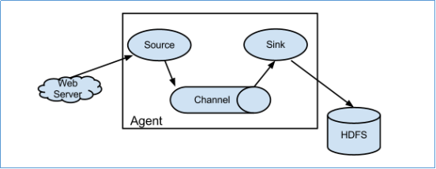
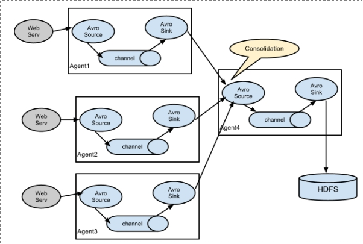

# Apache Flume

## 概述

官网:http://flume.apache.org/

Flume 是 Cloudera 提供的一个高可用的，高可靠的，分布式的海量日志采集、聚合和传输的工具。基于流式架构，容错性强，也很灵活简单。
Flume可以采集文件，socket数据包、文件、文件夹、kafka等各种形式源数据，又可以将采集到的数据(下沉sink)输出到HDFS、hbase、hive、kafka等众多外部存储系统中，一般的采集需求，通过对flume的简单配置即可实现
Flume针对特殊场景也具备良好的自定义扩展能力，因此，flume可以适用于大部分的日常数据采集场景。

- Flume是一个海量数据采集的软件。
- Flume是一款来自于apache  java语言软件。
- Flume身世
  - 0.9- 属于Cloudera  叫做flume-og
  - 1.0+ 属于apache  叫做**flume-ng** 


## 组件架构

1、Flume分布式系统中最核心的角色是agent，agent 本身是一个 Java 进程，一般运行在日志收集节点。flume采集系统就是由一个个agent所连接起来形成。
2、每一个agent相当于一个数据传递员，内部有三个组件：
a)Source：采集组件，用于跟数据源对接，以获取数据
b)Sink：下沉组件，用于往下一级agent传递数据或者往最终存储系统传递数据
c)Channel：传输通道组件，用于从source将数据传递到sink


简单结构



> Source 到 Channel 到 Sink之间传递数据的形式是Event事件；Event事件是一个数据流单元

复杂结构

多级agent之间串联



- 部署架构

  - 单agent架构

    ```
    适合简单业务场景  只需要部署一个agent进程即可
    ```

  - 多agent级联（串联）

    ```
    适合复杂业务场景  在此场景下 各个agent之间没有地位区别 大家都一样。没有主从之分。
    因为在多台机器部署的 也称之为分布式架构。
    ```

- 数据流程

Flume的一般流程是这样的:

source监控某个文件或数据流，数据源产生新的数据，拿到该数据后，将数据封装在一个Event中，并发送到channel后提交，channel队列先进先出，sink去channel队列中拉取数据，然后写入到HDFS/Kafka/或者其他的数据源,甚至是下一个Agent的Source。


- 组件

  - source

    ```
    对接各个不同的数据源。 采集数据。
    ```

  ​       常用的Source有:

  ​     1) exec：可通过tail -f命令去tail一个文件，然后实时同步日志到sink

  ​     2) spooldir：可监听一个目录，同步目录中的新文件到sink,被同步完的文件可被立即删除或被打上标记。       适合用于同步新文件，但不适合对实时追加日志的文件进行监听并同步。

  ​     3) taildir：可实时监控一批文件，并记录每个文件最新消费位置，agent进程重启后不会有重复消费的问题

  ​     4) 支持自定义

  

  - channel

    ```
    就是source和sink之间缓存数据的通道。
    ```

  ​       Channel是Agent 内部的数据传输通道，用于从 source 将数据传递到 sink；用于桥接Sources和Sinks，      类似于一个队列/缓存。Channel分为:

  ​      1) Memory Channel是基于内存的,速度快

  ​      2) File Channel是基于文件的,速度慢,因为会将所有事件写到磁盘,但数据更安全

  

  - sink

    ```
    对接各个不同下沉地(目的地)
    ```

  ​       Sink是下沉地/目的地，采集数据的传送目的地，用于从Channel收集数据，将数据写到目标源,Sink分为:

  ​      1) 可以是HDFS、HBase、Kafka等

  ​      2) 也可以是下一个 FlumeAgent的Source

  ​      3) 支持自定义

  

  - 结论：上述3个组件就组成了flume的一个java进程。该进程的名字叫做agent。

  

- Event

  - event是flume内部最小的数据单元。

  - flume采集的数据都是以event形式存在的。类似于数据包。

  - event分为event head /event body 数据都是存储在body中。

    ```
     Event: { headers:{} body: 6E 69 68 61 6F 0D                 }
    ```

## Flume 安装

- 提取将JDK配置好

- 上传安装包进行解压

  ```shell
  tar -zxvf flume-ng-1.6.0-cdh5.14.0.tar.gz -C /export/servers/
  ```

- 配置文件

  cd  /export/servers/apache-flume-1.6.0-cdh5.14.0-bin/conf

  ~~~
  cp  flume-env.sh.template flume-env.sh
  ~~~
  
  vim flume-env.sh
  
  ```shell
  export JAVA_HOME=/export/servers/jdk1.8.0_141
  ```

> ​    配置成自己得JDK安装版本和安装目录

## 案例

### 入门案例

  ~~~
需求：采集日志文件 如果有数据发送 采集数据打印到控制台。
  ~~~

#### 配置文件编写

- 所谓的采集方案指的就是根据业务需求 确定3个组件的类型和参数。 flume只有根据采集方案文件才指的如何工作。

- 确定3个组件

  ```
  source: TAILDIR  读取文件
  
  channel:memory channel 缓存在内存中
  
  sink: logger 把数据打印到控制台
  
  基于上述3个类型组件 编写采集方案。
  ```


cd /export/servers/apache-flume-1.6.0-cdh5.14.0-bin/conf/

vim  console-logger.conf

```properties

# Name the components on this agent
# 先定义这个agent中各组件的名字 a1
# 再给3个组件 分别起名字
a1.sources = r1
a1.sinks = k1
a1.channels = c1

# Describe/configure the source
# 描述和配置source组件：r1  
a1.sources.r1.type = TAILDIR
a1.sources.r1.filegroups = f1
a1.sources.r1.filegroups.f1 = /export/servers/tmp/flume/orderinfo.log

# Describe the sink
# 描述和配置source组件：r1
a1.sinks.k1.type = logger

# Use a channel which buffers events in memory
# 描述和配置channel组件，此处使用是内存缓存的方式
a1.channels.c1.type = memory
a1.channels.c1.capacity = 1000
a1.channels.c1.transactionCapacity = 100

# Bind the source and sink to the channel
# 描述和配置source  channel   sink之间的连接关系
a1.sources.r1.channels = c1
a1.sinks.k1.channel = c1
```

> 各组件得名称可以自定义


#### 数据源模拟

  模拟日志发送数据

~~~shell
echo "订单金额：100" >> /export/servers/tmp/flume/orderinfo.log
~~~


#### Flume启动命令

```shell
#完整版命令
bin/flume-ng agent --conf conf --conf-file conf/console-logger.conf --name a1 -Dflume.root.logger=INFO,console

#精简版命令
bin/flume-ng agent -c ./conf -f ./conf/console-logger.conf  -n a1 -Dflume.root.logger=INFO,console


#bin/flume-ng agent  固定搭配
#--conf（-c）
	指定默认的配置文件路径  要求改路径下 必须有两个文件：flume-env.sh log4j.properties
#--conf-file  （-f）
	指定采集方案文件路径
#--name	 指定agent的名字 进程名称 （-n）
	该名称可以随便起 但是要保证和采集方案中一致
#-Dflume.root.logger=INFO,console
	开启日志 打印更详细的信息 在开发中建议打开
```

> --name	 指定agent的名字表示进程名称，一定


### 采集数据到HDFS

- 案例1

  - 需求：某目录下，会不断产生新的文件，每当有新文件出现，就需要把文件采集到 HDFS中去

  - 确定agent组件

    ```
    source: TAILDIR
    channel: memory channel
    sink:  HDFS sink
    ```

    


#### 配置文件编写

cd /export/servers/apache-flume-1.6.0-cdh5.14.0-bin/conf

vim fileToHdfs.conf

~~~properties
#为我们的source channel  sink起名
a1.sources = r1
a1.channels = c1
a1.sinks = s1
#指定我们的source收集到的数据发送到哪个管道
a1.sources.r1.channels = c1
#指定我们的source数据收集策略
a1.sources.r1.type = TAILDIR
a1.sources.r1.filegroups = f1
a1.sources.r1.filegroups.f1 = /export/servers/tmp/flume/orderinfo.log

#指定我们的channel为memory,即表示所有的数据都装进memory当中
a1.channels.c1.type = memory
#指定我们的sink为kafka  sink，并指定我们的sink从哪个channel当中读取数据
a1.sinks.s1.channel = c1
a1.sinks.s1.type=hdfs
a1.sinks.s1.hdfs.path=hdfs://node1:8020/tmp/flume
a1.sinks.s1.hdfs.fileType=DataStream
~~~

#### 数据源模拟

  模拟日志发送数据

~~~shell
echo "订单金额：100" >> /export/servers/tmp/flume/orderinfo.log
~~~


#### Flume启动命令

```shell
#精简版命令
bin/flume-ng agent -c ./conf -f ./conf/fileToHdfs.conf  -n a1 -Dflume.root.logger=INFO,console
```

#### 优化配置

- 配置参数介绍

  ```shell
  #roll 控制文件以何种形式触发滚动 写入新文件
  a1.sinks.k1.hdfs.rollInterval = 3  #以时间间隔控制滚动  默认30 s
  a1.sinks.k1.hdfs.rollSize = 20    #以文件大小控制滚动  默认1024 bytes 
  a1.sinks.k1.hdfs.rollCount = 5    #以event数量控制滚动  默认 10 个
  
  #上述三个都配置的情况下 如果滚动？  谁先满足 谁触发滚动。
  #如果不想以某个属性滚动。 就把该属性设置为0  禁用该属性滚动。
  
  #注意事项  如果滚动条件设置不合理 会频繁触发文件切换 会造成大量小文件产生
  #在实际开发中 避免小文件产生  最喜欢根据128M大小进行滚动  134217728
  
  
  #round 是否开启时间上的舍弃  通俗解释：多少时间切换新的文件夹
  a1.sinks.k1.hdfs.round = true
  a1.sinks.k1.hdfs.roundValue = 10
  a1.sinks.k1.hdfs.roundUnit = minute
  ```

  - 注意事项  因为在flume中涉及到了动态提取时间**的功能  需要做下面两件事中任一即可：

    ```
    /flume/events/%y-%m-%d/%H%M/
    ```

    - 开启使用本地时间戳

      ```
      a1.sinks.k1.hdfs.useLocalTimeStamp = true
      ```

- 完整配置文件

cd /export/servers/apache-flume-1.6.0-cdh5.14.0-bin/conf

 vim fileToHdfs2.conf

~~~properties
a1.sources = r1
a1.channels = c1
a1.sinks = s1
#指定channel
a1.sources.r1.channels = c1
#指定我们的source数据收集策略
a1.sources.r1.type = exec
a1.sources.r1.command = tail -f  /export/servers/tmp/flume/test.log

#指定我们的channel为memory,即表示所有的数据都装进memory当中
a1.channels.c1.type = memory
#指定我们的sink到s1，并指定我们的sink从c1当中读取数据
a1.sinks.s1.channel = c1

a1.sinks.s1.type=hdfs
a1.sinks.s1.hdfs.path=hdfs://node1:8020/tmp/flume/%y-%m-%d/%H-%M/
a1.sinks.s1.hdfs.fileType=DataStream

a1.sinks.s1.hdfs.rollInterval = 3
a1.sinks.s1.hdfs.rollSize = 20
a1.sinks.s1.hdfs.rollCount = 5
a1.sinks.s1.hdfs.round = true
a1.sinks.s1.hdfs.roundValue = 10
a1.sinks.s1.hdfs.roundUnit = minute
a1.sinks.s1.hdfs.useLocalTimeStamp = true
a1.sinks.s1.hdfs.filePrefix = test
a1.sinks.s1.hdfs.fileSuffix = log                    
~~~


- 模拟日志增量数据

  - 日志内容不断增加，需要把采集数据追到日志文件中，并实时写入到 hdfs

  - 确定3个组件

    ```
    source:  exec   #支持在flume中运行shell命令 把命令执行的结果作为数据源进行采集。
    		 shell：tail -f 文件路径
    channel: memory channel  基于内存缓存数据
    sink: hdfs sink
    ```

  - 编写增量日志脚本

    cd /export/servers/tmp/flume 

  ​        vim shell_log.sh

  ```shell
  while true;do date >> /export/servers/tmp/flume/test.log;sleep 0.5;done
  
  
  
  #!/bin/bash
  while true
  do
   date >>  /export/servers/tmp/flume/test.log
   sleep 0.5
  done
  ```

> sh脚本赋权限：chmod 755 shell_log.sh 

执行脚本：

~~~shell
sh  shell_log.sh
~~~

查看日志：

~~~shell
tail -f /export/servers/tmp/flume/test.log 
~~~

启动flume命令：

~~~shell
bin/flume-ng agent -c ./conf -f ./conf/fileToHdfs2.conf  -n a1 -Dflume.root.logger=INFO,console
~~~


### 采集数据到Kafka

#### 配置文件编写

cd /export/servers/apache-flume-1.6.0-cdh5.14.0-bin/conf

vim fileToKafka.conf

~~~properties
#为我们的source channel  sink起名
a1.sources = r1
a1.channels = c1
a1.sinks = k1
#指定我们的source收集到的数据发送到哪个管道
a1.sources.r1.channels = c1
#指定我们的source数据收集策略
a1.sources.r1.type = TAILDIR
a1.sources.r1.filegroups = f1
a1.sources.r1.filegroups.f1 = /export/servers/tmp/flume/orderinfo.log

#指定我们的channel为memory,即表示所有的数据都装进memory当中
a1.channels.c1.type = memory
#指定我们的sink为kafka  sink，并指定我们的sink从哪个channel当中读取数据
a1.sinks.k1.channel = c1
a1.sinks.k1.type = org.apache.flume.sink.kafka.KafkaSink
a1.sinks.k1.kafka.topic = test2
a1.sinks.k1.kafka.bootstrap.servers = node1:9092,node2:9092,node3:9092
a1.sinks.k1.kafka.flumeBatchSize = 20
a1.sinks.k1.kafka.producer.acks = 1
~~~

#### 数据源模拟

  模拟日志发送数据

~~~shell
echo "订单金额：100" >> /export/servers/tmp/flume/orderinfo.log
~~~


#### Flume启动命令

```shell
#精简版命令
bin/flume-ng agent -c ./conf -f ./conf/fileToKafka.conf  -n a1 -Dflume.root.logger=INFO,console
```


#### kafka消费命令

~~~
bin/kafka-console-consumer.sh --bootstrap-server node1:9092,node2:9092,node3:9092 --topic test2
~~~


