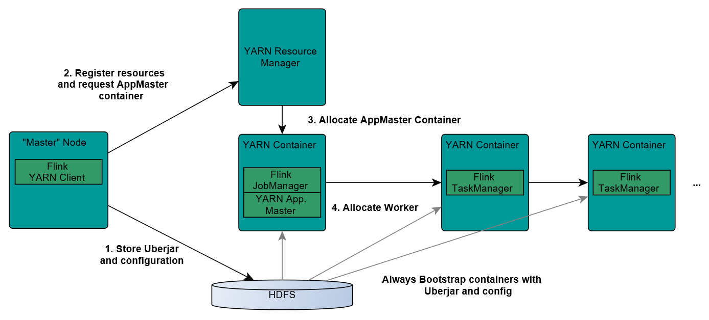
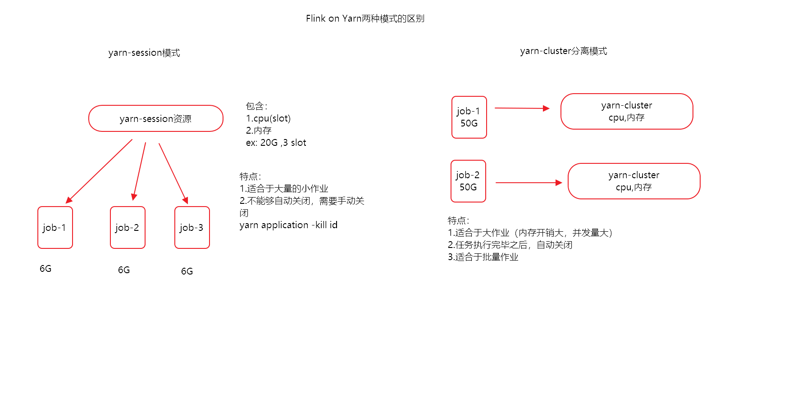
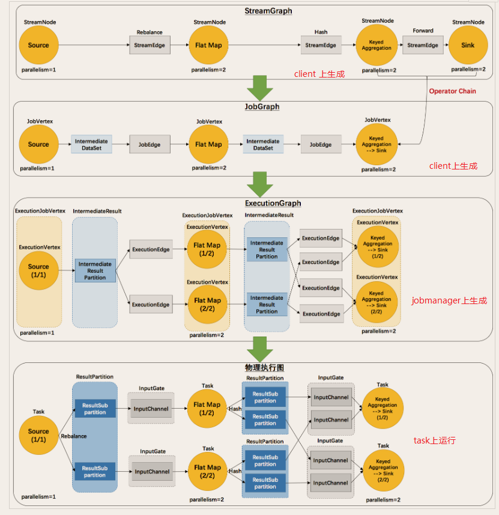
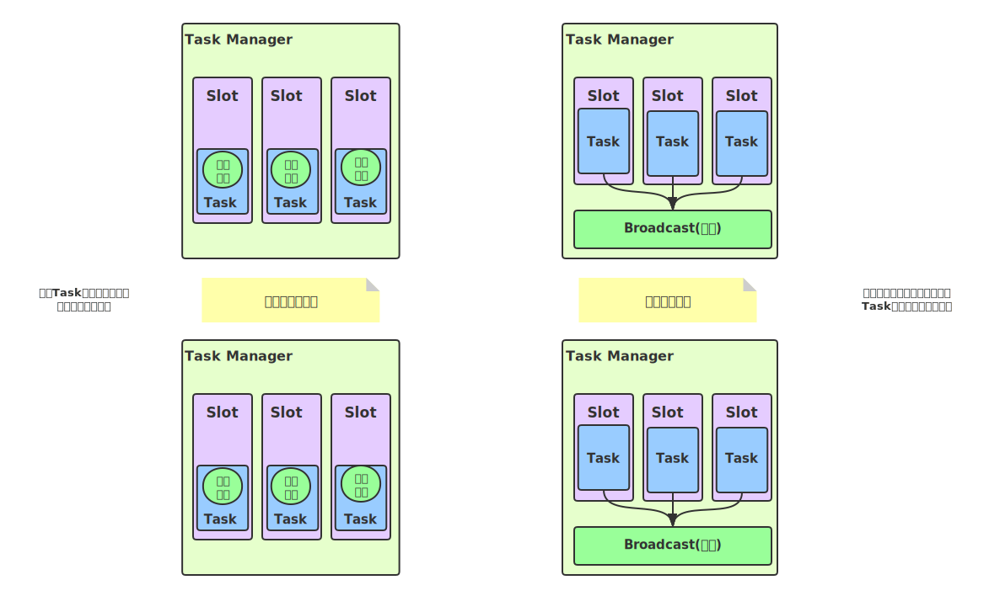
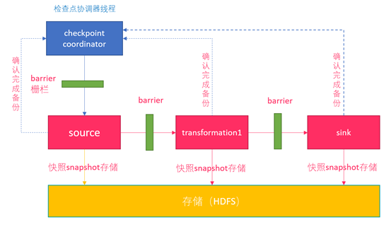
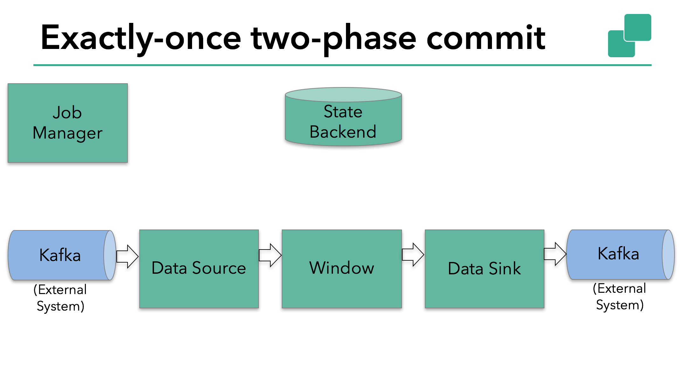
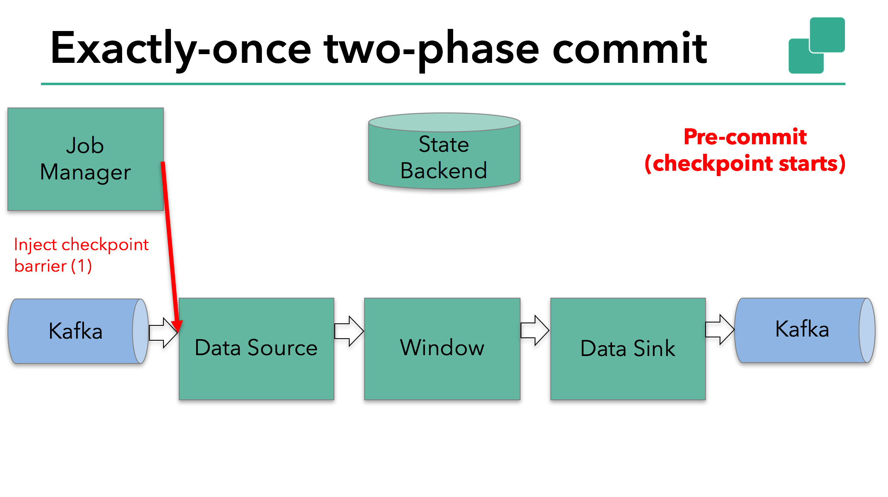
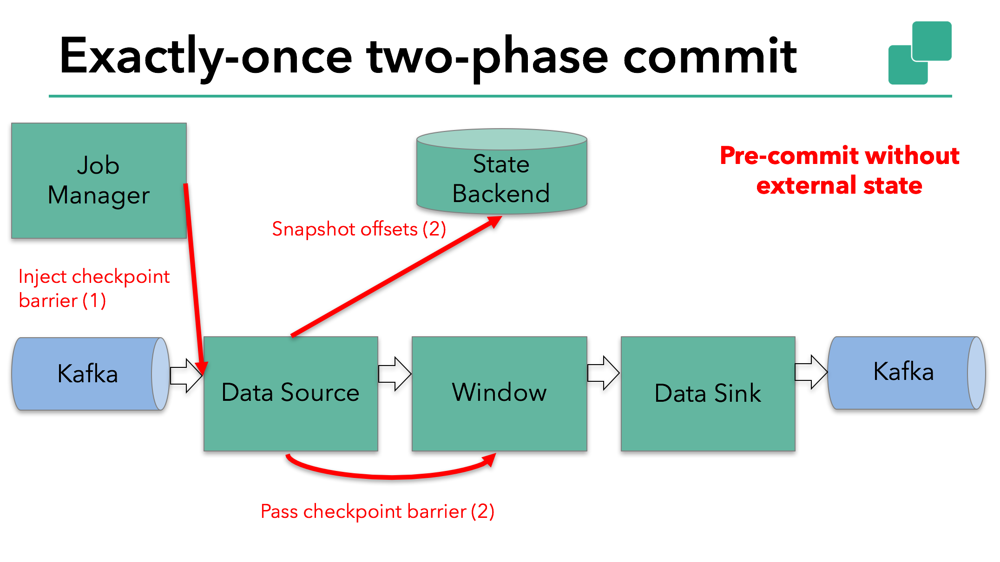
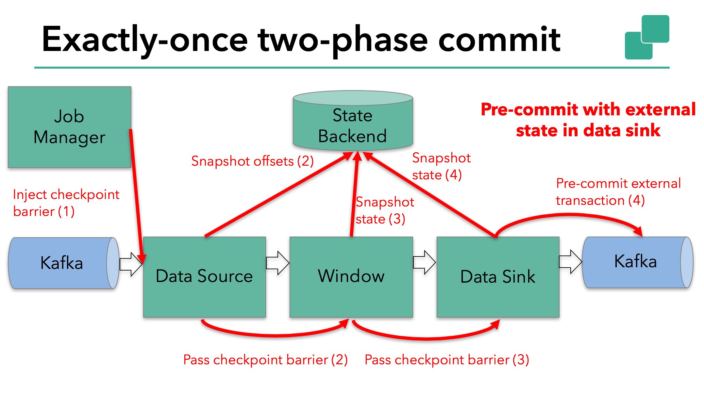
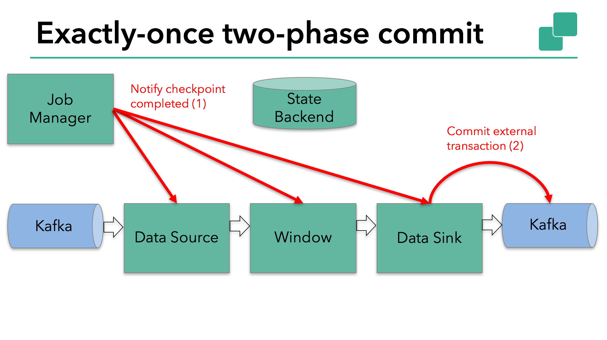

# Flink

## 环境搭建

### Local本地模式

#### 原理

- 1.Flink程序由JobClient进行提交

- 2.JobClient将作业提交给JobManager

- 3.JobManager负责协调资源分配和作业执行。资源分配完成后，任务将提交给相应的TaskManager

- 4.TaskManager启动一个线程以开始执行。TaskManager会向JobManager报告状态更改,如开始执行，正在进行或已完成。 

- 5.作业执行完成后，结果将发送回客户端(JobClient)

#### 基本使用（本地集群）

- 启动命令

  - 在Flink的bin目录下：

    - 启动

    ~~~shell
    ./start-cluster.sh
    ~~~

    - 停止

    ~~~shell
    ./stop-cluster.sh
    ~~~

  - Web-UI：

    ~~~
    node1:8081
    ~~~

### StandAlone独立集群模式

#### 原理

- client客户端提交任务给JobManager
- JobManager负责申请任务运行所需要的资源并管理任务和资源
- JobManager分发任务给TaskManager执行
- TaskManager定期向JobManager汇报状态

#### 环境配置

- 编辑flink-conf.yml文件

  ~~~shell
  vim /export/server/flink/conf/flink-conf.yaml
  hobmanager.rpc.address:node1
  ~~~

- 编辑master文件

  ~~~
  node1:8081
  ~~~

- 修改slaves

  ~~~shell
  node1
  node2
  node3
  ~~~

- 分发安装包

  ~~~shell
  scp -r flink-1.10.0/ node2:$PWD
  scp -r flink-1.10.0/ node3:$PWD
  ~~~

#### 基本使用

- 启动集群

  ~~~shell
  /export/server/flink/bin/start-cluster.sh
  ~~~

- 访问Web-UI：

  ~~~
  node1:8081
  ~~~

  

### StandAloneHA高可用模式

#### 配置

- 机器规划

  ~~~
  - 服务器: node1(Master + Slave): JobManager + TaskManager
  - 服务器: node2(Master + Slave): JobManager + TaskManager
  - 服务器: node3(Slave): TaskManager
  ~~~

- 修改flink-conf.yml

  ~~~shell
  vim /export/server/flink/conf/flink-conf.yaml
  ~~~

  ~~~yml
  #开启HA，使用文件系统作为快照存储
  state.backend: filesystem
  
  #启用检查点，可以将快照保存到HDFS
  state.backend.fs.checkpointdir: hdfs://node1:8020/flink-checkpoints
  
  #使用zookeeper搭建高可用
  high-availability: zookeeper
  
  # 存储JobManager的元数据到HDFS
  high-availability.storageDir: hdfs://node1:8020/flink/ha/
  
  # 配置ZK集群地址
  high-availability.zookeeper.quorum: node1:2181,node2:2181,node3:2181
  
  ~~~

- 修改masters

  ~~~
  node1:8081
  node2:8081
  ~~~

- 同步给node2、node3

  ~~~shell
  scp -r /export/server/flink/conf/flink-conf.yaml node2:/export/server/flink/conf/
  scp -r /export/server/flink/conf/flink-conf.yaml node3:/export/server/flink/conf/
  scp -r /export/server/flink/conf/masters node2:/export/server/flink/conf/
  scp -r /export/server/flink/conf/masters node3:/export/server/flink/conf/
  ~~~

- 修改node2上的flink-conf.yml文件

  ~~~
  jobmanager.rpc.address: node2
  ~~~

#### 基本使用

- 1.启动Zookeeper

- 2.启动HDFS

- 3.Node1上启动Flink集群

  - 启动

    ~~~shell
    /export/server/flink/bin/start-cluster.sh
    ~~~

  - 关闭

    ~~~shell
    /export/server/flink/bin/stop-cluster.sh
    ~~~

  

### Flink On Yarn模式

> 企业中主流使用的模式

#### 原理

- 1.Client上传jar包和配置文件到HDFS集群上

- 2.Client向Yarn ResourceManager提交任务并申请资源

- 3.ResourceManager分配Container资源并启动ApplicationMaster,然后AppMaster加载Flink的Jar包和配置构建环境,启动JobManager

  > JobManager和ApplicationMaster运行在同一个container上。一旦他们被成功启动，AppMaster就知道JobManager的地址(AM它自己所在的机器)。它就会为TaskManager生成一个新的Flink配置文件(他们就可以连接到JobManager)。这个配置文件也被上传到HDFS上。此外，AppMaster容器也提供了Flink的web服务接口。YARN所分配的所有端口都是临时端口，这允许用户并行执行多个Flink

- 4.ApplicationMaster向ResourceManager申请工作资源,NodeManager加载Flink的Jar包和配置构建环境并启动TaskManager

- 5.TaskManager启动后向JobManager发送心跳包，并等待JobManager向其分配任务

#### 两种模式

##### Session会话模式

- 特点：需要事先申请资源，启动JobManager和TaskManger

- 优点：不需要每次递交作业申请资源，而是使用已经申请好的资源，从而提高执行效率

- 缺点：**作业执行完成以后，资源不会被释放，因此一直会占用系统资源**

- 应用场景：适合作业递交比较频繁的场景，**小作业比较多的场景**

###### 基本使用

- 命令行：

~~~shell
./yarn-session.sh -tm 1024 -jm 1024 -s 1 -d
~~~

> tm： 每一个taskmanager的申请内存
>
> jm：jobmanager的申请内存
>
> -s ：slot的数量，cpu核数，表示并发执行能力
>
> -d：跳出会话窗口

- 查看yarn列表

~~~
yarn application -list
~~~

- kill session命令：

~~~shell
yarn application -kill application_1603091655912_0002
~~~

- yarn session模式部署和standalone模式的区别：

> session模式，申请好资源之后，不用，就不消耗资源，用的时候，才消耗资源
>
> standalone,集群启动的时候，会自动申请好资源，不管用不用，资源会一直存在

##### Job分离模式

- 特点：每次递交作业都需要申请一次资源

- 优点：**作业运行完成，资源会立刻被释放，不会一直占用系统资源**

- 缺点：每次递交作业都需要申请资源，会影响执行效率，因为申请资源需要消耗时间

- 应用场景：**适合作业比较少的场景、大作业的场景**

- 执行命令：

~~~shell
flink run -m yarn-cluster -ytm 1024 -yjm 1024 -ys 1 ../examples/batch/WordCount.jar 
~~~

>  -m: 指定cluster模式
>
>  -ytm :每一个taskmanager的申请内存
>
>  -yjm: jobmanager的申请内存
>
>  -ys： slot的数量

##### 两种模式的区别

## Flink运行时组件

- Flink运行时架构主要包括四个不同的组件，它们会在运行流处理应用程序时协同工作：
  - 作业管理器（JobManager）：分配任务、调度checkpoint做快照
  -  任务管理器（TaskManager）：主要干活的
  - 资源管理器（ResourceManager）：管理分配资源
  - 分发器（Dispatcher）：方便递交任务的接口，WebUI

- 因为Flink是用Java和Scala实现的，所以所有组件都会运行在Java虚拟机上。每个组件的职责如下：
  - 作业管理器（JobManager）
    - 控制一个应用程序执行的主进程，也就是说，每个应用程序都会被一个不同的JobManager 所控制执行。
    - JobManager 会先接收到要执行的应用程序，这个应用程序会包括：作业图（JobGraph）、逻辑数据流图（logical dataflow graph）和打包了所有的类、库和其它资源的JAR包。
    - JobManager 会把JobGraph转换成一个物理层面的数据流图，这个图被叫做“执行图”（ExecutionGraph），包含了所有可以并发执行的任务。
    - JobManager 会向资源管理器（ResourceManager）请求执行任务必要的资源，也就是任务管理器（TaskManager）上的插槽（slot）。一旦它获取到了足够的资源，就会将执行图分发到真正运行它们的TaskManager上。而在运行过程中，JobManager会负责所有需要中央协调的操作，比如说检查点（checkpoints）的协调。
  - 任务管理器（TaskManager）
    - Flink中的工作进程。通常在Flink中会有多个TaskManager运行，每一个TaskManager都包含了一定数量的插槽（slots）。插槽的数量限制了TaskManager能够执行的任务数量。
    - 启动之后，TaskManager会向资源管理器注册它的插槽；收到资源管理器的指令后，TaskManager就会将一个或者多个插槽提供给JobManager调用。JobManager就可以向插槽分配任务（tasks）来执行了。
    - 在执行过程中，一个TaskManager可以跟其它运行同一应用程序的TaskManager交换数据。
  - 资源管理器（ResourceManager）
    - 主要负责管理任务管理器（TaskManager）的插槽（slot），TaskManger 插槽是Flink中定义的处理资源单元。
    - Flink为不同的环境和资源管理工具提供了不同资源管理器，比如YARN、Mesos、K8s，以及standalone部署。
    - 当JobManager申请插槽资源时，ResourceManager会将有空闲插槽的TaskManager分配给JobManager。如果ResourceManager没有足够的插槽来满足JobManager的请求，它还可以向资源提供平台发起会话，以提供启动TaskManager进程的容器。
  - 分发器（Dispatcher）
    - 可以跨作业运行，它为应用提交提供了REST接口。
    - 当一个应用被提交执行时，分发器就会启动并将应用移交给一个JobManager。
    - Dispatcher也会启动一个Web UI，用来方便地展示和监控作业执行的信息。
    - Dispatcher在架构中可能并不是必需的，这取决于应用提交运行的方式。

## ExecutionGraph

- 原理介绍
  - Flink执行executor会自动根据程序代码生成DAG数据流图
  - Flink 中的执行图可以分成四层：StreamGraph -> JobGraph -> ExecutionGraph -> 物理执行图。
  - StreamGraph：是根据用户通过 Stream API 编写的代码生成的最初的图。表示程序的拓扑结构。
  - JobGraph：StreamGraph经过优化后生成了 JobGraph，提交给 JobManager 的数据结构。主要的优化为，将多个符合条件的节点 chain 在一起作为一个节点，这样可以减少数据在节点之间流动所需要的序列化/反序列化/传输消耗。
  - ExecutionGraph：JobManager 根据 JobGraph 生成ExecutionGraph。ExecutionGraph是JobGraph的并行化版本，是调度层最核心的数据结构。
  - 物理执行图：JobManager 根据 ExecutionGraph 对 Job 进行调度后，在各个TaskManager 上部署 Task 后形成的“图”，并不是一个具体的数据结构。

- 简单理解：
  - StreamGraph：最初的程序执行逻辑流程，也就是算子之间的前后顺序（全部都是Subtask）
  - JobGraph：将部分可以合并的Subtask合并成一个Task
  - ExecutionGraph：为Task赋予并行度
  - 物理执行图：将Task赋予并行度后的执行流程，落实到具体的TaskManager上，将具体的Task落实到具体的Slot内进行运行。

## 总体架构

> 本部分援引自网络，如有侵权请[联系我](roohom@qq.com)删除

### 核心组件

按照上面的介绍，Flink 核心架构的第二层是 Runtime 层， 该层采用标准的 Master - Slave 结构， 其中，Master 部分又包含了三个核心组件：Dispatcher、ResourceManager 和 JobManager，而 Slave 则主要是 TaskManager 进程。它们的功能分别如下：

- **JobManagers** (也称为 *masters*) ：JobManagers 接收由 Dispatcher 传递过来的执行程序，该执行程序包含了作业图 (JobGraph)，逻辑数据流图 (logical dataflow graph) 及其所有的 classes 文件以及第三方类库 (libraries) 等等 。紧接着 JobManagers 会将 JobGraph 转换为执行图 (ExecutionGraph)，然后向 ResourceManager 申请资源来执行该任务，一旦申请到资源，就将执行图分发给对应的 TaskManagers 。因此每个作业 (Job) 至少有一个 JobManager；高可用部署下可以有多个 JobManagers，其中一个作为 *leader*，其余的则处于 *standby* 状态。
- **TaskManagers** (也称为 *workers*) : TaskManagers 负责实际的子任务 (subtasks) 的执行，每个 TaskManagers 都拥有一定数量的 slots。Slot 是一组固定大小的资源的合集 (如计算能力，存储空间)。TaskManagers 启动后，会将其所拥有的 slots 注册到 ResourceManager 上，由 ResourceManager 进行统一管理。
- **Dispatcher**：负责接收客户端提交的执行程序，并传递给 JobManager 。除此之外，它还提供了一个 WEB UI 界面，用于监控作业的执行情况。
- **ResourceManager** ：负责管理 slots 并协调集群资源。ResourceManager 接收来自 JobManager 的资源请求，并将存在空闲 slots 的 TaskManagers 分配给 JobManager 执行任务。Flink 基于不同的部署平台，如 YARN , Mesos，K8s 等提供了不同的资源管理器，当 TaskManagers 没有足够的 slots 来执行任务时，它会向第三方平台发起会话来请求额外的资源。

  

### Task & SubTask

上面我们提到：TaskManagers 实际执行的是 SubTask，而不是 Task，这里解释一下两者的区别：

在执行分布式计算时，Flink 将可以链接的操作 (operators) 链接到一起(Operator Chains)，这就是 Task。之所以这样做， 是为了减少线程间切换和缓冲而导致的开销，在降低延迟的同时可以提高整体的吞吐量。 但不是所有的 operator 都可以被链接，如下 keyBy 等操作会导致网络 shuffle 和重分区，因此其就不能被链接，只能被单独作为一个 Task。  简单来说，**一个 Task 就是一个可以链接的最小的操作链 (Operator Chains)** 。如下图，source 和 map 算子被链接到一块，因此整个作业就只有三个 Task：

  

解释完 Task ，我们在解释一下什么是 SubTask，其准确的翻译是： *A subtask is one parallel slice of a task*，即**一个 Task 可以按照其并行度拆分为多个 SubTask**。如上图，source & map 具有两个并行度，KeyBy 具有两个并行度，Sink 具有一个并行度，因此整个虽然只有 3 个 Task，但是却有 5 个 SubTask。Jobmanager 负责定义和拆分这些 SubTask，并将其交给 Taskmanagers 来执行，每个 SubTask 都是一个单独的线程。

### 资源管理

理解了 SubTasks ，我们再来看看其与 Slots 的对应情况。一种可能的分配情况如下：

  

这时每个 SubTask 线程运行在一个独立的 TaskSlot， 它们共享所属的 TaskManager 进程的TCP 连接（通过多路复用技术）和心跳信息 (heartbeat messages)，从而可以降低整体的性能开销。此时看似是最好的情况，但是每个操作需要的资源都是不尽相同的，这里假设该作业 keyBy 操作所需资源的数量比 Sink 多很多 ，那么此时 Sink 所在 Slot 的资源就没有得到有效的利用。

基于这个原因，<u>Flink 允许多个 subtasks 共享 slots，即使它们是不同 tasks 的 subtasks，但只要它们来自同一个 Job 就可以</u>。假设上面 souce & map 和 keyBy 的并行度调整为 6，而 Slot 的数量不变，此时情况如下：

  

可以看到一个 Task Slot 中运行了多个 SubTask 子任务，此时每个子任务仍然在一个独立的线程中执行，只不过共享一组 Slot 资源而已。那么 <u>Flink 到底如何确定一个 Job 至少需要多少个 Slot 呢？</u>Flink 对于这个问题的处理很简单，**默认情况一个 Job 所需要的 Slot 的数量就等于其 Operation 操作的最高并行度**。如下， A，B，D 操作的并行度为 4，而 C，E 操作的并行度为 2，那么此时整个 Job 就需要至少四个 Slots 来完成。通过这个机制，Flink 就可以不必去关心一个 Job 到底会被拆分为多少个 Tasks 和 SubTasks。

  

### 组件通讯

Flink 的所有组件都基于 Actor System 来进行通讯。Actor system是多种角色的 actor 的容器，它提供调度，配置，日志记录等多种服务，并包含一个可以启动所有 actor 的线程池，如果 actor 是本地的，则消息通过共享内存进行共享，但如果 actor 是远程的，则通过 RPC 的调用来传递消息。

  

## 广播变量

- Flink支持广播。可以将数据广播到TaskManager上就可以供TaskManager中的SubTask/task去使用，数据存储到内存中。这样可以减少大量的shuffle操作，而不需要多次传递给集群节点；

- 比如在数据join阶段，不可避免的就是大量的shuffle操作，我们可以把其中一个dataSet广播出去，一直加载到taskManager的内存中，可以直接在内存中拿数据，避免了大量的shuffle，导致集群性能下降；

注意：

- 广播变量是要把dataset广播到内存中，所以广播的数据量不能太大，否则会出现OOM
- 广播变量的值不可修改，这样才能确保每个节点获取到的值都是一致的

### 如何使用

 编码步骤:

- 1：广播数据
  - .withBroadcastSet(DataSet, "name");

- 2：获取广播的数据
  - Collection<> broadcastSet =  getRuntimeContext().getBroadcastVariable("name");

- 3:使用广播数据

## 分布式缓存

- Flink提供了一个分布式缓存，类似于hadoop，可以使用户在并行函数中很方便的读取本地文件，并把它放在taskmanager节点中，防止task重复拉取。
- 此缓存的工作机制如下：程序注册一个文件或者目录(本地或者远程文件系统，例如hdfs或者s3)，通过ExecutionEnvironment注册缓存文件并为它起一个名称。
- 当程序执行，<u>Flink自动将文件或者目录复制到所有taskmanager节点的本地文件系统，仅会执行一次</u>。用户可以通过这个指定的名称查找文件或者目录，然后从taskmanager节点的本地文件系统访问它。

### 如何使用

编码步骤:

- 1：注册一个分布式缓存文件
  - env.registerCachedFile("hdfs:///path/file", "cachefilename") 

- 2：访问分布式缓存文件中的数据
  -  File myFile = getRuntimeContext().getDistributedCache().getFile("cachefilename");

开发步骤：

- 1.获取执行环境
- 2.加载数据源
- 3.注册分布式缓存文件
- 4.数据转换
  - （1）获取分布式缓存文件
  - （2）FileUtils解析文件
  - （3）数据组合
- 5.数据打印执行

## State

### Keyed State & Operator State

- Managed State的有KeyedState和OperatorState
- Raw State的都是OperatorState

#### Keyed State

顾名思义就是Keyed Stream上的State，其与流上的特定的key绑定，对于流上每一个key可能都对应于一个State

- ValueState getState(ValueStateDescriptor)
- ReducingState getReducingState(ReducingStateDescriptor)
  - 这种状态通过用户传入的reduceFunction，每次调用`add`方法添加值的时候，会调用reduceFunction，最后合并到一个单一的状态值
- ListState getListState(ListStateDescriptor)
- FoldingState getFoldingState(FoldingStateDescriptor)
  - 跟ReducingState有点类似，不过它的状态值类型可以与`add`方法中传入的元素类型不同（这种状态将会在Flink未来版本中被删除）
- MapState getMapState(MapStateDescriptor)
  - 即状态值为一个map。用户通过`put`或`putAll`方法添加元素

> Flink通过`StateDescriptor`来定义一个状态。这是一个抽象类，内部定义了状态名称、类型、序列化器等基础信息。与上面的状态对应，从`StateDescriptor`派生了`ValueStateDescriptor`, `ListStateDescriptor`等descriptor。

一个使用MapState的样例：

~~~java
/**
 * @ClassName: MinStockWindowFunction
 * @Author: Roohom
 * @Function: 分时个股窗口处理
 * @Date: 2020/11/2 15:00
 * @Software: IntelliJ IDEA
 */
public class MinStockWindowFunction extends RichWindowFunction<CleanBean, StockBean, String, TimeWindow> {

    MapState<String, StockBean> stockMs = null;
    /**
     * @param parameters
     * @throws Exception
     */
    @Override
    public void open(Configuration parameters) throws Exception {
        stockMs = getRuntimeContext().getMapState(new MapStateDescriptor<String, StockBean>("stockMs", String.class, StockBean.class));
    }

    /**
     * @param s      分组字段
     * @param window 窗口
     * @param input  输入数据
     * @param out    输出数据
     * @throws Exception PASS
     */
    @Override
    public void apply(String s, TimeWindow window, Iterable<CleanBean> input, Collector<StockBean> out) throws Exception {
        //记录最新个股
        CleanBean cleanBean = null;
        for (CleanBean bean : input) {
            if (cleanBean == null) {
                cleanBean = bean;
            }
            if (cleanBean.getEventTime() < bean.getEventTime()) {
                cleanBean = bean;
            }
        }
        //获取分时成交额和成交数量
        StockBean stockBeanLast = stockMs.get(cleanBean.getSecCode());
        Long tradeVol = 0L;
        Long tradeAmt = 0L;
        if (stockBeanLast != null) {
            //获取上一分钟的成交金额和成交数量
            Long tradeVolDayLast = stockBeanLast.getTradeVolDay();
            Long tradeAmtDayLast = stockBeanLast.getTradeAmtDay();

            //分时成交量,分时成交量 （当前分钟的总成交量- 上一分钟的总成交量）
            tradeVol = cleanBean.getTradeVolume() - tradeVolDayLast;
            //分时成交金额,分时成交金额 （当前分钟的总成交金额- 上一分钟的总成交金额）
            tradeAmt = cleanBean.getTradeAmt() - tradeAmtDayLast;
        }
        Long tradeTime = DateUtil.longTimeTransfer(cleanBean.getEventTime(), Constant.format_YYYYMMDDHHMMSS);

        //封装输出流数据
        StockBean stockBean = new StockBean(
                cleanBean.getEventTime(),
                cleanBean.getSecCode(),
                cleanBean.getSecName(),
                cleanBean.getPreClosePrice(),
                cleanBean.getOpenPrice(),
                cleanBean.getMaxPrice(),
                cleanBean.getMinPrice(),
                cleanBean.getTradePrice(),
                tradeVol, tradeAmt,
                cleanBean.getTradeVolume(),
                cleanBean.getTradeAmt(),
                tradeTime,
                cleanBean.getSource()
        );
        out.collect(stockBean);
        //更新MapState
        stockMs.put(cleanBean.getSecCode(), stockBean);
    }
}
~~~

#### Operator State

Operator State与特定的算子Operator进行绑定，整个Operator只对应于一个State，而在一个算子operator上可能有多个key，也就对应多个keyed state

### Managed State & Raw State

- 托管状态
  - **由Flink本身去管理**，**将状态数据转换为HashTables或者RocksDB对象进行存储**，然后持久化于Checkpoint，用于异常恢复
- 原生状态
  - **算子自身管理数据结构**，触发Checkpoint后，**将数据转换为Bytes**，然后存储在Checkpoint上，异常恢复时，由算子自身进行反序列化Bytes获得数据

两者相同点：

- 都依赖于Checkpoint

不同点：

- 从状态管理方式的方式来说，Managed State 由 Flink Runtime 管理，自动存储，自动恢复，在内存管理上有优化；而 Raw State 需要用户自己管理，需要自己序列化，Flink 不知道 State 中存入的数据是什么结构，只有用户自己知道，需要最终序列化为可存储的数据结构。
- 从状态数据结构来说，Managed State 支持已知的数据结构，如 Value、List、Map 等。而 Raw State只支持字节数组 ，所有状态都要转换为二进制字节数组才可以。
- 从推荐使用场景来说，Managed State 大多数情况下均可使用，而 Raw State 是当 Managed State 不够用时，比如需要自定义 Operator 时，才会使用 Raw State。

## 容错机制

### Checkpoint

**某一时刻,Flink中所有的Operator的当前State的全局快照**,一般存在磁盘上，表示了一个Flink Job在一个特定时刻的一份全局状态快照，即包含了所有Operator的状态，可以理解为Checkpoint是把State数据定时持久化存储了

> 比如KafkaConsumer算子中维护的Offset状态,当任务重新恢复的时候可以从Checkpoint中获取

### 执行流程

- 0.Flink的JobManager创建CheckpointCoordinator

- 1.Coordinator向所有的SourceOperator发送Barrier栅栏(理解为执行Checkpoint的信号)

- 2.SourceOperator接收到Barrier之后,暂停当前的操作(暂停的时间很短,因为后续的写快照是异步的),并制作State快照, 然后将自己的快照保存到指定的介质中(如HDFS), 一切 ok之后向Coordinator汇报并将Barrier发送给下游的其他Operator
- 3.其他的如TransformationOperator接收到Barrier,重复第2步,最后将Barrier发送给Sink
- 4.Sink接收到Barrier之后重复第2步
- 5.Coordinator接收到所有的Operator的执行ok的汇报结果,认为本次快照执行成功

 

> 注意:
>
> 1.在往介质(如HDFS)中写入快照数据的时候是异步的(为了提供效率)
>
> 2.分布式快照执行时的数据一致性由Chandy-Lamport algorithm分布式快照算法保证! 

### State状态后端/State存储介质

> Checkpoint是Flink在某一时刻的所有Operator的全局快照，这些快照的存储就叫**状态后端**

- MemStateBackend

  - 存储在内存，不安全，不推荐使用

- FsStateBackend

  - 存储在文件系统上，可以是本地可以是HDFS等（如果在分布式的情况下选择存储本地，可能会使得恢复失败）
  - 常规使用状态的作业、例如分钟级窗口聚合或 join、需要开启HA的作业

- RocksDBStateBackend

  > RocksDB 是一个 key/value 的内存存储系统，和其他的 key/value 一样，先将状态放到内存中，如果内存快满时，则写入到磁盘中

  - 存储在外部存储系统
  - 超大状态的作业，例如天级窗口聚合、需要开启 HA 的作业、最好是对状态读写性能要求不高的作业

### Savepoint

> 实际中为了对集群进行停机维护扩容等，需要将集群的状态暂时备份，共维护完成后从维护前的状态继续运行，也就是需要开发人员执行一次手动的Checkpoint，与Checkpoint不同的是（简单理解），Savepoint是手动触发的。

### Savepoint和Checkpoint的对比

- 1.目标：从概念上讲，Savepoints和Checkpoints的不同之处类似于传统数据库中备份和恢复日志的不同。<u>Checkpoints的作用是确保程序有潜在失败可能的情况下（如网络暂时异常）,可以正常恢复</u>。相反，<u>Savepoints的作用是让用户手动触发备份后，通过重启来恢复程序。</u>

- 2.实现：Checkpoints和Savepoints在实现上有所不同。<u>Checkpoints轻量并且快速，它可以利用底层状态存储的各种特性，来实现快速备份和恢复</u>。例如，以RocksDB作为状态存储，状态将会以RocksDB的格式持久化而不是Flink原生的格式，同时利用RocksDB的特性实现了增量Checkpoints。这个特性加速了checkpointing的过程，也是Checkpointing机制中第一个更轻量的实现。相反，<u>Savepoints更注重数据的可移植性，并且支持任何对任务的修改，同时这也让Savepoints的备份和恢复成本相对更高</u>。

- 3.生命周期：<u>Checkpoints本身是定时自动触发的。它们的维护、创建和删除都由Flink自身来操作，不需要任何用户的干预</u>。相反，<u>Savepoints的触发、删除和管理等操作都需要用户手动触发</u>。

  

## End To End Exactly-Once

> 整合Kafka

**Exactly Once是指所有的记录仅影响内部状态一次**

而

**End to End Exactly Once是指所有的记录仅影响<u>内部和外部</u>状态一次**

### 版本说明

- Flink 1.4版本之前，支持Exactly Once语义，仅限于应用内部。

- Flink 1.4版本之后，通过两阶段提交(TwoPhaseCommitSinkFunction)支持End-To-End Exactly Once，而且要求Kafka 0.11+。

- 利用TwoPhaseCommitSinkFunction是通用的管理方案，只要实现对应的接口，而且Sink的存储支持变乱提交，即可实现端到端的一次性语义。

> 在 Flink 中的Two-Phase-Commit-2PC两阶段提交的实现方法被封装到了 TwoPhaseCommitSinkFunction 这个抽象类中，只需要实现其中的beginTransaction、preCommit、commit、abort 四个方法就可以实现“精确一次”的处理语义，如FlinkKafkaProducer就实现了该类并实现了这些方法

### 具体流程

#### 开始

数据源是Kafka，内部是窗口聚合，数据经过处理之后外部输出写入Kafka

#### 预提交 内部状态

##### Checkpointing

Checkpoint开始的时候，即进入“预提交阶段”，Flink的JobManager会将Barrier注入数据流，barrier在Operator之间进行传递，所到之处的Operator将状态快照写入State Backend

数据源保存了消费Kafka的偏移量(offset)，之后将checkpoint barrier传递给下一个operator。

这种方式仅适用于operator具有<u>内部</u>状态。所谓内部状态，是指Flink state backend保存和管理的 。例如，第二个operator中window聚合算出来的sum值。当一个进程有它的内部状态的时候，<u>除了在checkpoint之前需要将数据变更写入到state backend，不需要在预提交阶段执行任何其他操作</u>。Flink负责在checkpoint成功的情况下正确提交这些写入，或者在出现故障时中止这些写入

##### 预提交外部状态

> 外部数据源也必须具有事务机制，才能保证两阶段提交协议的集成，而Kakfa满足这一点，在该示例中的数据需要写入Kafka，因此数据输出端（Data Sink）有外部状态。在这种情况下，在预提交阶段，除了将其状态写入state backend之外，数据输出端还必须预先提交其外部事务。

当Checkpoint Barrier在所有的Operator之间传递完成之后，并且所有的Operator快照都已制作完成时，预提交阶段即完成，所有的状态快照都属于Checkpoint的一部分，Checkpoint是整个应用程序状态的快照，包含预先提交的外部状态，当程序发生故障或者突然宕机时，Flink可以将所有状态依据最近的一个成功的Checkpoint恢复到上次快照的时间点

##### 提交阶段

进入提交阶段，Job Manager通知所有的Operator Checkpoint已经制作完成了，这些Operator只要负责等待就行，不必进行其他的操作，Data Sink端开始进行外部事务的提交

##### 总结

1.一旦所有operator完成预提交，就提交一个commit。

2.如果只要有一个预提交失败，则所有其他提交都将中止，我们将回滚到上一个成功完成的checkpoint。

3.在预提交成功之后，提交的commit需要保证最终成功 – operator和外部系统都需要保障这点。如果commit失败（例如，由于间歇性网络问题），整个Flink应用程序将失败，应用程序将根据用户的重启策略重新启动，还会尝试再提交。这个过程至关重要，因为如果commit最终没有成功，将会导致数据丢失。

4.完整的实现两阶段提交协议可能有点复杂，这就是为什么Flink将它的通用逻辑提取到抽象类TwoPhaseCommitSinkFunction中的原因。

## 并行度

> 一个Flink程序由多个Operator来执行，一个Operator又由多个Task（线程）来执行， 一个Operator的并行Task(线程)数目就被称为该Operator(任务)的并行度(Parallelism)

### 并行度的设置方式

- Operator Level（算子级别）

  - 一个算子、数据源和sink的并行度可以通过调用 setParallelism()方法来指定

- Execution Environment Level（Env级别）

  - 执行环境(任务)的默认并行度可以通过调用setParallelism()方法指定。为了以并行度3来执行所有的算子、数据源和data sink，可以通过设置执行环境全部并行度的方式设置并行度

    ~~~java
    StreamExecutionEnviroment env = StreamExecutionEnviroment.getExecutionEnviroment();
    env.setParallelism(3);
    ~~~

- Client Level(客户端级别,推荐使用)

  - 在客户端程序提交到Flink时在命令行或者参数设置

  - 对于Cli客户端可以是用参数`-p`来设置并行度

    ~~~shell
    ./bin/flink run -p 10 WordCount-java.jar
    ~~~

- System Level（系统默认级别,尽量不使用）

  - 在系统级可以通过设置flink-conf.yaml文件中的parallelism.default属性来指定所有执行环境的默认并行度

### 设置并行度的级别

算子级别 > env级别 > Client级别 > 系统默认级别

> 越靠前具体的代码并行度的优先级越高

> 注意：
>
> 1.并行度的优先级：算子级别 > env级别 > Client级别 > 系统默认级别 (越靠前具体的代码并行度的优先级越高)
>
> 2.如果source不可以被并行执行，即使指定了并行度为多个，也不会生效
>
> 3.在实际生产中，我们推荐在算子级别显示指定各自的并行度，方便进行显示和精确的资源控制。
>
> 4.slot是静态的概念，是指taskmanager具有的并发执行能力; parallelism是动态的概念，是指程序运行时实际使用的并发能力

## Flink CEP

**CEP**：复杂事件分析。在无界的数据流上，定义模式匹配规则，实时获取匹配到的规则数据。一个复杂的事件可以由多个模式匹配规则组成。

- 优点：
  - 高吞吐
  - API友好
    - Pattern（定义规则）
    - CEP（查询数据）
- 缺点
  - 无法动态更新规则

> 特点：查询是静态的，数据是动态的

### API

- 量词
  - Times
  - oneOrMore
- 模式
  - 单模式
  - 组合模式

