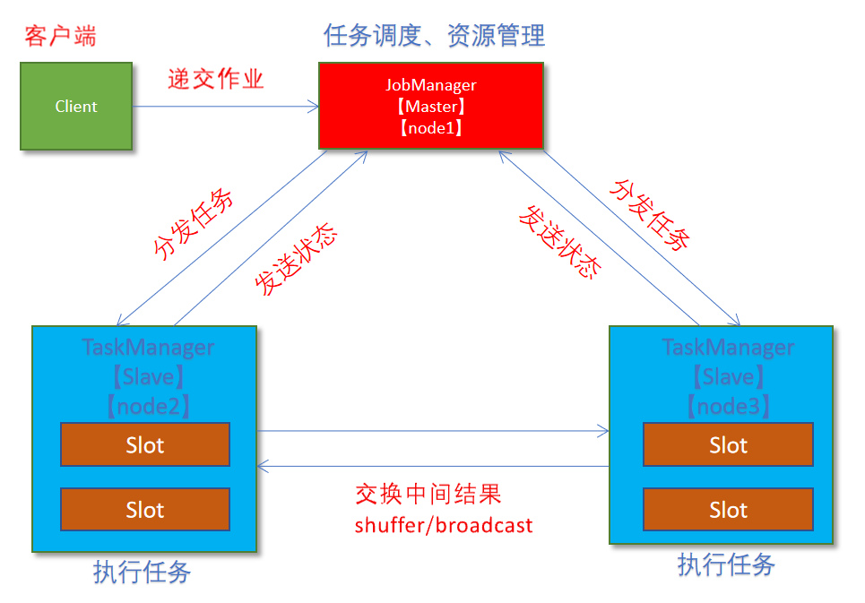
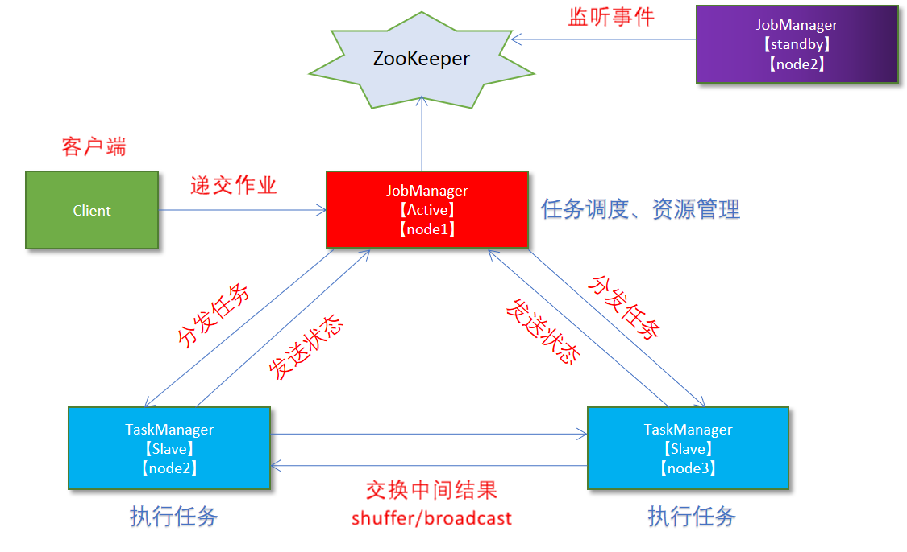
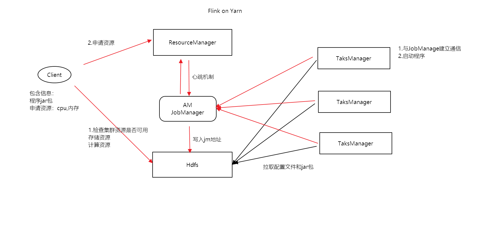
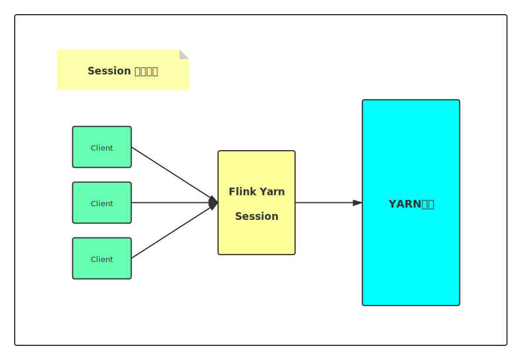
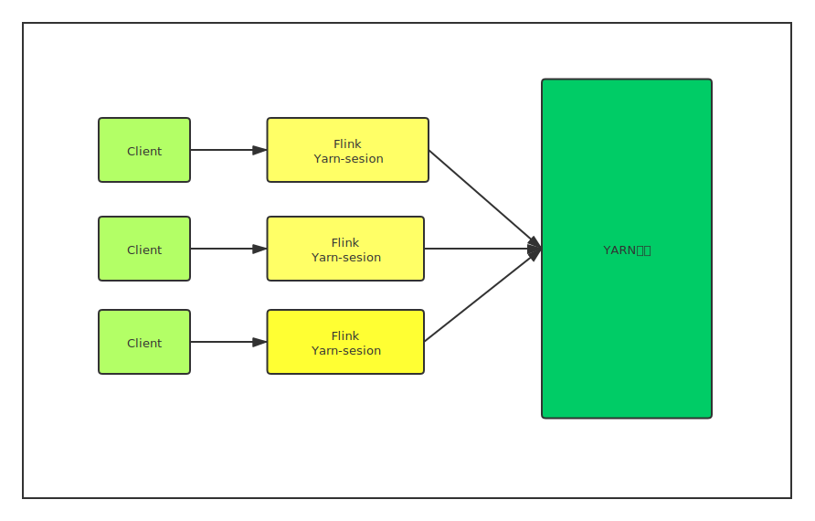
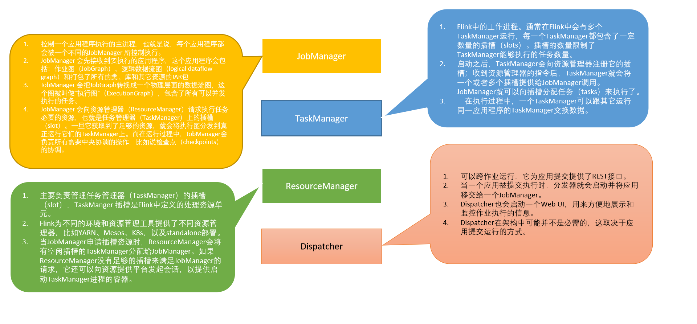

# Flink基础配置与基础原理

## 环境搭建

### Local本地模式

#### 原理

- 1.Flink程序由JobClient进行提交

- 2.JobClient将作业提交给JobManager

- 3.JobManager负责协调资源分配和作业执行。资源分配完成后，任务将提交给相应的TaskManager

- 4.TaskManager启动一个线程以开始执行。TaskManager会向JobManager报告状态更改,如开始执行，正在进行或已完成。 

- 5.作业执行完成后，结果将发送回客户端(JobClient)

#### 基本使用（本地集群）

- 启动命令

  - 在Flink的bin目录下：

    - 启动

    ~~~shell
    ./start-cluster.sh
    ~~~

    - 停止

    ~~~shell
    ./stop-cluster.sh
    ~~~

  - Web-UI：

    ~~~
    node1:8081
    ~~~

### StandAlone独立集群模式

#### 原理

- client客户端提交任务给JobManager
- JobManager负责申请任务运行所需要的资源并管理任务和资源
- JobManager分发任务给TaskManager执行
- TaskManager定期向JobManager汇报状态

#### 环境配置

- 编辑flink-conf.yml文件

  ~~~shell
  vim /export/server/flink/conf/flink-conf.yaml
  hobmanager.rpc.address:node1
  ~~~

- 编辑master文件

  ~~~
  node1:8081
  ~~~

- 修改slaves

  ~~~shell
  node1
  node2
  node3
  ~~~

- 分发安装包

  ~~~shell
  scp -r flink-1.10.0/ node2:$PWD
  scp -r flink-1.10.0/ node3:$PWD
  ~~~

#### 基本使用

- 启动集群

  ~~~shell
  /export/server/flink/bin/start-cluster.sh
  ~~~

- 访问Web-UI：

  ~~~
  node1:8081
  ~~~

  

### StandAloneHA高可用模式

#### 配置

- 机器规划

  ~~~
  - 服务器: node1(Master + Slave): JobManager + TaskManager
  - 服务器: node2(Master + Slave): JobManager + TaskManager
  - 服务器: node3(Slave): TaskManager
  ~~~

- 修改flink-conf.yml

  ~~~shell
  vim /export/server/flink/conf/flink-conf.yaml
  ~~~

  ~~~yml
  #开启HA，使用文件系统作为快照存储
  state.backend: filesystem
  
  #启用检查点，可以将快照保存到HDFS
  state.backend.fs.checkpointdir: hdfs://node1:8020/flink-checkpoints
  
  #使用zookeeper搭建高可用
  high-availability: zookeeper
  
  # 存储JobManager的元数据到HDFS
  high-availability.storageDir: hdfs://node1:8020/flink/ha/
  
  # 配置ZK集群地址
  high-availability.zookeeper.quorum: node1:2181,node2:2181,node3:2181
  
  ~~~

- 修改masters

  ~~~
  node1:8081
  node2:8081
  ~~~

- 同步给node2、node3

  ~~~shell
  scp -r /export/server/flink/conf/flink-conf.yaml node2:/export/server/flink/conf/
  scp -r /export/server/flink/conf/flink-conf.yaml node3:/export/server/flink/conf/
  scp -r /export/server/flink/conf/masters node2:/export/server/flink/conf/
  scp -r /export/server/flink/conf/masters node3:/export/server/flink/conf/
  ~~~

- 修改node2上的flink-conf.yml文件

  ~~~
  jobmanager.rpc.address: node2
  ~~~

#### 基本使用

- 1.启动Zookeeper

- 2.启动HDFS

- 3.Node1上启动Flink集群

  - 启动

    ~~~shell
    /export/server/flink/bin/start-cluster.sh
    ~~~

  - 关闭

    ~~~shell
    /export/server/flink/bin/stop-cluster.sh
    ~~~

  

### Flink On Yarn模式

> 企业中主流使用的模式

#### 原理

- 1.Client上传jar包和配置文件到HDFS集群上

- 2.Client向Yarn ResourceManager提交任务并申请资源

- 3.ResourceManager分配Container资源并启动ApplicationMaster,然后AppMaster加载Flink的Jar包和配置构建环境,启动JobManager

  > JobManager和ApplicationMaster运行在同一个container上。一旦他们被成功启动，AppMaster就知道JobManager的地址(AM它自己所在的机器)。它就会为TaskManager生成一个新的Flink配置文件(他们就可以连接到JobManager)。这个配置文件也被上传到HDFS上。此外，AppMaster容器也提供了Flink的web服务接口。YARN所分配的所有端口都是临时端口，这允许用户并行执行多个Flink

- 4.ApplicationMaster向ResourceManager申请工作资源,NodeManager加载Flink的Jar包和配置构建环境并启动TaskManager

- 5.TaskManager启动后向JobManager发送心跳包，并等待JobManager向其分配任务

#### 两种模式

##### Session会话模式

- 特点：需要事先申请资源，启动JobManager和TaskManger

- 优点：不需要每次递交作业申请资源，而是使用已经申请好的资源，从而提高执行效率

- 缺点：**作业执行完成以后，资源不会被释放，因此一直会占用系统资源**

- 应用场景：适合作业递交比较频繁的场景，**小作业比较多的场景**

###### 基本使用

- 命令行：

~~~shell
./yarn-session.sh -tm 1024 -jm 1024 -s 1 -d
~~~

> tm： 每一个taskmanager的申请内存
>
> jm：jobmanager的申请内存
>
> -s ：slot的数量，cpu核数，表示并发执行能力
>
> -d：跳出会话窗口

- 查看yarn列表

~~~
yarn application -list
~~~

- kill session命令：

~~~shell
yarn application -kill application_1603091655912_0002
~~~

- yarn session模式部署和standalone模式的区别：

> session模式，申请好资源之后，不用，就不消耗资源，用的时候，才消耗资源
>
> standalone,集群启动的时候，会自动申请好资源，不管用不用，资源会一直存在

##### Job分离模式

- 特点：每次递交作业都需要申请一次资源

- 优点：**作业运行完成，资源会立刻被释放，不会一直占用系统资源**

- 缺点：每次递交作业都需要申请资源，会影响执行效率，因为申请资源需要消耗时间

- 应用场景：**适合作业比较少的场景、大作业的场景**

- 执行命令：

~~~shell
flink run -m yarn-cluster -ytm 1024 -yjm 1024 -ys 1 ../examples/batch/WordCount.jar 
~~~

>  -m: 指定cluster模式
>
>  -ytm :每一个taskmanager的申请内存
>
>  -yjm: jobmanager的申请内存
>
>  -ys： slot的数量

##### 两种模式的区别

## Flink运行时组件

- Flink运行时架构主要包括四个不同的组件，它们会在运行流处理应用程序时协同工作：
  - 作业管理器（JobManager）：分配任务、调度checkpoint做快照
  -  任务管理器（TaskManager）：主要干活的
  - 资源管理器（ResourceManager）：管理分配资源
  - 分发器（Dispatcher）：方便递交任务的接口，WebUI

- 因为Flink是用Java和Scala实现的，所以所有组件都会运行在Java虚拟机上。每个组件的职责如下：
  - 作业管理器（JobManager）
    - 控制一个应用程序执行的主进程，也就是说，每个应用程序都会被一个不同的JobManager 所控制执行。
    - JobManager 会先接收到要执行的应用程序，这个应用程序会包括：作业图（JobGraph）、逻辑数据流图（logical dataflow graph）和打包了所有的类、库和其它资源的JAR包。
    - JobManager 会把JobGraph转换成一个物理层面的数据流图，这个图被叫做“执行图”（ExecutionGraph），包含了所有可以并发执行的任务。
    - JobManager 会向资源管理器（ResourceManager）请求执行任务必要的资源，也就是任务管理器（TaskManager）上的插槽（slot）。一旦它获取到了足够的资源，就会将执行图分发到真正运行它们的TaskManager上。而在运行过程中，JobManager会负责所有需要中央协调的操作，比如说检查点（checkpoints）的协调。
  - 任务管理器（TaskManager）
    - Flink中的工作进程。通常在Flink中会有多个TaskManager运行，每一个TaskManager都包含了一定数量的插槽（slots）。插槽的数量限制了TaskManager能够执行的任务数量。
    - 启动之后，TaskManager会向资源管理器注册它的插槽；收到资源管理器的指令后，TaskManager就会将一个或者多个插槽提供给JobManager调用。JobManager就可以向插槽分配任务（tasks）来执行了。
    - 在执行过程中，一个TaskManager可以跟其它运行同一应用程序的TaskManager交换数据。
  - 资源管理器（ResourceManager）
    - 主要负责管理任务管理器（TaskManager）的插槽（slot），TaskManger 插槽是Flink中定义的处理资源单元。
    - Flink为不同的环境和资源管理工具提供了不同资源管理器，比如YARN、Mesos、K8s，以及standalone部署。
    - 当JobManager申请插槽资源时，ResourceManager会将有空闲插槽的TaskManager分配给JobManager。如果ResourceManager没有足够的插槽来满足JobManager的请求，它还可以向资源提供平台发起会话，以提供启动TaskManager进程的容器。
  - 分发器（Dispatcher）
    - 可以跨作业运行，它为应用提交提供了REST接口。
    - 当一个应用被提交执行时，分发器就会启动并将应用移交给一个JobManager。
    - Dispatcher也会启动一个Web UI，用来方便地展示和监控作业执行的信息。
    - Dispatcher在架构中可能并不是必需的，这取决于应用提交运行的方式。

## ExecutionGraph

- 原理介绍
  - Flink执行executor会自动根据程序代码生成DAG数据流图
  - Flink 中的执行图可以分成四层：StreamGraph -> JobGraph -> ExecutionGraph -> 物理执行图。
  - StreamGraph：是根据用户通过 Stream API 编写的代码生成的最初的图。表示程序的拓扑结构。
  - JobGraph：StreamGraph经过优化后生成了 JobGraph，提交给 JobManager 的数据结构。主要的优化为，将多个符合条件的节点 chain 在一起作为一个节点，这样可以减少数据在节点之间流动所需要的序列化/反序列化/传输消耗。
  - ExecutionGraph：JobManager 根据 JobGraph 生成ExecutionGraph。ExecutionGraph是JobGraph的并行化版本，是调度层最核心的数据结构。
  - 物理执行图：JobManager 根据 ExecutionGraph 对 Job 进行调度后，在各个TaskManager 上部署 Task 后形成的“图”，并不是一个具体的数据结构。

- 简单理解：
  - StreamGraph：最初的程序执行逻辑流程，也就是算子之间的前后顺序（全部都是Subtask）
  - JobGraph：将部分可以合并的Subtask合并成一个Task
  - ExecutionGraph：为Task赋予并行度
  - 物理执行图：将Task赋予并行度后的执行流程，落实到具体的TaskManager上，将具体的Task落实到具体的Slot内进行运行。

## Flink CEP

**CEP**：复杂事件分析。在无界的数据流上，定义模式匹配规则，实时获取匹配到的规则数据。一个复杂的事件可以由多个模式匹配规则组成。

- 优点：
  - 高吞吐
  - API友好
    - Pattern（定义规则）
    - CEP（查询数据）
- 缺点
  - 无法动态更新规则

> 特点：查询是静态的，数据是动态的

### API

- 量词
  - Times
  - oneOrMore
- 模式
  - 单模式
  - 组合模式

