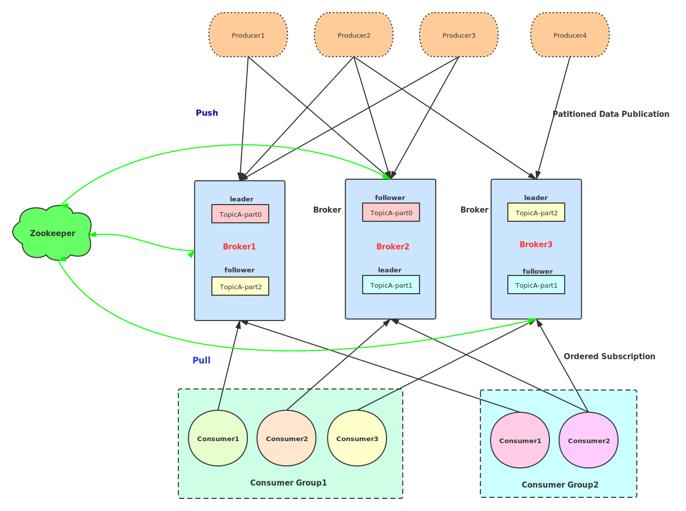
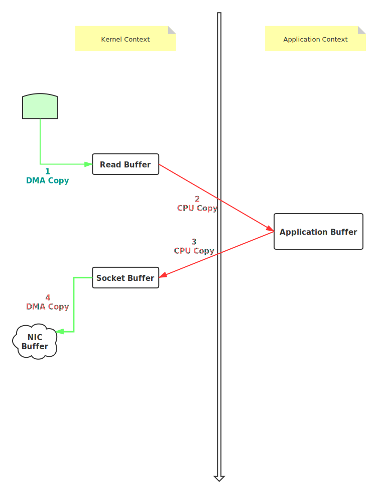

# Kafka

> 分布式消息订阅发布系统

## 消息队列

### 消息队列MQ

- 消息队列：Message queue
- 定义：用于在两个消息系统或者模块之间实现消息数据的缓存，通过队列的方式实现数据传输
- 问题：实际业务中访问服务器的请求并发量过大，会导致服务故障，或者请求丢失等等，无法确保每一条数据都被处理，怎么解决？
  - 解决：引入消息队列，不侧重于性能，而侧重于保证最终每一条请求都被处理了，将大量的数据放入消息队列：先进先出，先生成，先被处理

### 同步与异步

- 消息队列在整体的业务模式上是异步模式

- 有一些场景下不能使用异步来实现业务需求
- 业务流程的同步与异步
  - 同步：用户看到的结果就是最后的结果
    - 用户提交需求，后台处理需求，将处理的结果返回给用户
  - 异步：用户看到的结果还不是最后的结果
    - 用户提交需求，后台直接返回临时结果，后台再处理这个请求
- 数据传输的同步与异步
  - 同步
    - A给B发送数据，B确认收到之后，A再发下一条
    - TCP协议
      - 特点：慢，数据安全的**三次握手**
  - 异步
    - A给B发送第一条数据，不管B有没有收到，就发送第二条
    - UDP协议
      - 特点：快，数据易丢失

### 应用场景

- 解耦
- 异步处理
  - 降低数据都市或者应用故障的风险
  - 允许并发对消息系统中的数据进行读写
- 限流削峰
  - 避免峰值资源分配的不合理
- 构建消息系统
  - 系统A -> 消息队列 -> 系统B -> 消息队列 -> 系统C

### 缺点

- 必须保证消息队列的稳定及安全性
  - 一旦消息队列故障，整个系统全部瘫痪
  - 如果机器故障？
    - 需要构建分布式消息队列：多台机器的集群，如果有任何一台机器故障，其他机器仍然可以提供服务
  - 如何保证数据丢失，照样可以消费？
    - HDFS：副本
    - Hbase：WAL+HDFS副本
- 运维更加复杂
  - 生产者：向消息队列中发送写入数据
  - 消费者：向消息队列中消费读取数据
  - 必须确保生产到消息队列之间的数据安全
  - 必须确保消费者消费消息队列的数据安全
    - **如何避免出现数据重复或者数据丢失的问题？**
      - 必须保证：**生产者的数据在消息队列中只存储一份**
      - 必须保证：**消费者消费消息队列中的数据，只成功消费一次**
      - 最终保证：一次性语义
        - 至少一次：数据重复问题
        - 至多一次：数据丢失问题
        - 仅有一次：只有1次

### 消息队列的两种模式

- 点对点模式
  - 角色
    - 生产者
    - 消费者
    - 消息队列
  - 特点：如果消费者消费完这条数据会给消息队列一个确认，消息队列一旦收到这个确认，就会删除这条数据
  - 问题：消息队列中的数据不能共享，只能有一个消费者进行消费
- 订阅发布模式
  - 角色
    - 生产者
    - 消费者
    - 消息队列：主题Topic
  - 特点：允许多个生产者、主题、消费者、能实现数据共享，并且可以随机地添加生产者和消费者

## Kafka的介绍和以及应用

### 功能

- 定义：分布式的基于订阅发布模式的消息队列系统
- 流式存储、流式计算
- 应用：实时存储来解决大数据实时架构中的数据缓存的问题

### 特点

- 分布式：解决高并发、存储、故障冗余的问题
- 高吞吐量：分布式

- 可扩展的高性能：上千台机器的集群，每天上万亿级别的数据存储
- 高容错：数据不会丢失，避免数据的丢失与重复
- 高可用：分布式架构，多台机器，副本机制

### 特殊概念

- 生产者：Producer

  - 用于往kafka的Topic中生产数据
  - 实际工作中都是**数据采集工具**

- 消费者/消费者组：Consumer

  - 用于从kafka的Topic中消费数据

  - 实际工作中：一般都是分布式流式计算程序：SparkStreaming、Flink

    > 注意：kafka中以消费者组为单位来实现数据的消费
    >
    > - 任何一个消费者必然属于某一个消费者组
    > - 一个消费者组中可以包含多个消费者
    > - 一个消费者组消费一份数据：如果一个组内有多个消费者，所有消费者消费的数据加在一起是一份完整的数据

- Broker：一个Broker就是一个Kafka节点

  - 多个Broker构建Kafka集群
  
- Topic：主题

  - 用于区分不同的数据的存储
    - 生产者将不同的数据生产到不同对Topic
    - 消费者根据需求从不同的Topic中消费数据

- Partition：分区

  - 类似于HBASE中的Region
  - 一个Topic需要构建分布式存储，就会构建多个分区
  - 不同的分区可以存储在不同的kafka节点上，实现分布式存储
  - 分区规则：
    - HDFS：文件：Block
      - 按照大小：128M
    - Hbase：表：Region
      - 按照范围：rowkey数据哪个区间(region)就写入对应的region
    - Kafka：Topic：Partition
      - 多种分区规则

- Replication：分区副本 
  - 每个分区可以构建对应的副本分区
  - 例如：创建三个分区，构建两个副本
  - 总共：存储6个分区
  - 同一个分区的相同副本不能在同一台机器
  - **分区的副本数不允许超过机器数**
  - **问题：一个分区有多个副本，在读写时，往哪个副本读写呢？**
    - 解决：Kafka中将一个分区的多个副本构建主从角色
      - 主副本分区：负责接收生产者和消费的读写请求
      - 从副本分区：负责与主副本分区同步数据
        - 如果主副本丢失或故障，从副本会重新选举一个新的主副本
        - 依赖于Zookeeper实现选举
    - 无论是主副本分区还是从副本分区，都是分区，且数据相同

- Segment：分区段，对这个分区的数据更细的划分
  - 按照数据写入的时间先后进行划分
  - 类似于HBASE中的Store，对整个分区的数据再进行划分
  - 每个segment包含一对文件
    - .log文件
    - .index文件
  - .Log：写入Kafka的数据存储在.log文件中
  - .index：与.log文件成对出现，文件名称一致
    - 对应.log文件的索引
    - 每次读取数据先读.index索引，根据索引信息再读.log文件
- Offset：数据在分区中的偏移量
  - **功能：标记消费者消费数据的位置，当消费者故障，根据上一次消费者消费到的位置，从上次消费的位置继续消费**
  - 每个Topic的每个分区的偏移量是独立的
  - 每个分区写入的第一条数据的偏移量是从0开始的
    - 生产：按照数据写入分区的顺序来标记偏移量

    - 消费：指定偏移量进行消费

    - 举个栗子

      - Topic

        - part0
        - part1
        - part2

      - 生产者：写数据

        - 按照分区规则将数据写入对应分区

        - part0

          ```
          0		hadoop   Redis
          1		spark
          2		flink
          ```

        - part1

          ```
          0		hive
          1		hue
          ```

        - part2

          ```
          0		hbase
          1		oozie
          ```

      - 消费者：读数据

        - 按照每个分区的offset来进行消费的

        - part0：1

          ```
          hadoop    Redis
          ```

        - part1:1

          ```
          hive
          ```

        - part2：1

          ```
          hbase
          ```

### 架构




- Hbase：Table：Region：Store：mem&storefile
- Kakfa：Topic：Partition：Segment：.log & .index
- 架构
  - Kafka Broker：Kafka节点
  - Zookeeper
    - 辅助选举：分区副本主从选举
    - Kafka的元数据：所有kafka节点信息、Topic的信息、分区的信息
  - Kafka也是分布式主从架构
    - Kafka所有节点的进程都叫Kafka，任何一个Kafka节点都可以接受请求
    - 主：Kafka Controler：管理（**如何管理？**）
      - 早期版本对于分区和副本的管理依靠zookeeper的watcher和队列
      - 新版本只有[Kafka Controller](https://www.cnblogs.com/huxi2b/p/6980045.html)
        - 副本leader故障，帮助选举出新的副本leader
        - ISR列表变化，通知集群所有broker更新其元数据
        - 集群增加某个分区时，管理分区的重新分配
    - 从：Broker

## 自定义分区规则

### 规则

- Kafka中一个Topic可以对应多个分区，当写入数据会根据分区规则将这个数据写入对应的分区
- 分区规则：
  - 方式一：如果给定Key，按照Key的hash取余分区个数
  - 方式二：如果没有给定Key，按照轮询方式
  - 方式三：指定分区写入
  - 方式四：自定义分区规则
- **自定义分区的规则**
  - 实现partition方法
  - 重写partition方法

### 实现

#### 生产者代码设置

~~~java
//自定义分区方式
props.put("partitioner.class","bigdata.itcast.cn.kafka.partition.UserPartition");
~~~

#### 自定义随机分区类

~~~java
package bigdata.itcast.cn.kafka.partition;

import org.apache.kafka.clients.producer.Partitioner;
import org.apache.kafka.common.Cluster;

import java.util.Map;
import java.util.Random;

/**
 * @ClassName UserPartition
 * @Description TODO 用于实现Kafka中的自定义分区
 * @Date 2020/9/26 10:15
 * @Create By     Frank
 */
public class UserPartition implements Partitioner {

    /**
     * 用于返回当前数据对应的分区编号
     * @param topic：当前数据所对应的Topic名称
     * @param key：K
     * @param keyBytes：K的字节类型
     * @param value：V
     * @param valueBytes：V的字节类型
     * @param cluster：集群信息
     * @return
     */
    public int partition(String topic, Object key, byte[] keyBytes, Object value, byte[] valueBytes, Cluster cluster) {
        //获取分区的个数
        Integer forTopic = cluster.partitionCountForTopic(topic);
        //构建一个随机值对象
        Random random = new Random();
        //指定random取值
        int i = random.nextInt(forTopic);
        //返回随机值
        return i;
    }

    public void close() {
        //释放资源
    }

    public void configure(Map<String, ?> configs) {
        //获取配置的方法
    }
}

~~~


## 手动控制Offset

### 自动提交offset

- offset作用
  - 为了保证一次性语义：有且仅成功消费一次，不重复不丢失
  - 为了记录消费者消费的位置
  - 应用场景
    - 情况1：如果消费者故障，消费者重启，应该继故障之前没有处理的数据位置继续消费
      - 问题：消费者程序如何知道上次处理的位置？
      - 解决：通过offset来标记每个消费者消费的每个Topic对应的每个分区的消费位置
    - 情况2：动态地添加或者删除一个消费者组中的消费者的时候
      - 新添加的消费者不知道前一个消费者消费的位置
        - 通过offset来记录
  
- 存储机制：默认的管理机制：由kafka自动管理offset
  - 当前kafka中每一个消费者组消费的每个topic的每个分区的offset都记录在这个topic中
  
    ~~~
    __consumer_offsets
    
    groupid  topic  part   offset
    ~~~
  
    
  
  - 问题：**消费者不断消费，如何保证offset的更新，记录消费者消费的最新位置？**
  
  - 自动机制：自动定时提交offset
    
    - 第一次消费：kafka中没有这个消费者组的信息，就依据`auto.offset.reset=latest`参数决定从什么位置消费\
    
      - `auto.offset.reset=latest`：如果kafka中没有消费记录就从每个分区**最新的位置**开始消费，如果有消费记录，就从消费记录位置开始消费
      - `auto.offset.reset=earliest`：如果kafka中没有消费记录，从每个分区**最早的位置**开始消费，如果kafka中有消费记录，从消费记录开始消费
      - `auto.offset.reset=none`：如果有任何一个分区没有记录，直接抛出异常
    
    - 配置：
    
      ~~~java
      props.put("enable.auto.commit", "true");//Kafka自动更新最新的offset
      props.put("auto.commit.interval.ms", "1000");//按照一定时间单位提交更新一次
      ~~~
  
- 问题：数据丢失的问题？

  - 场景：消费者每隔100ms从kafka消费一次，消费成功，但是将数据处理的时候处理失败，消费者故障，若此时**达到kafka的offset提交时间**，kafka会记录这次的消费，理论上消费者再重新启动的时候应该从上次处理失败的记录开始重新处理，但是kafka已经记录了消费成功了，这样导致了**数据丢失**
  - 场景：消费者每隔100ms从kafka消费一次，消费者处理成功，没有达到offset提交时间，这时候消费者故障，kafka没有记录这次的消费，在消费者重启之后应该根据kafka提供的记录重新消费，获取到的还是上次成功执行过的记录，就会导致**数据重复**

- 出现问题的原因：提交的规则与处理的结果没有关系

  - 实际要保证数据的唯一：必须按照处理的结果来提交offset

### 手动提交Topic offset

- 为什么要手动管理offset
  - **重点用于消费者程序故障时，确保数据的不丢失不重复的消费**
  - 必须确保记录的offset与数据处理的结果是一致的
    - 处理的结果与提交offset的存储，保证是一个**同步**的状态
    - 只要处理成功，就立即记录offset
    - 如果处理失败，直接重试即可
- 修改配置：关闭自动提交，手动提交
  - 不论是自动提交还是手动提交：offset都存储在__consumer_offset中
  
  - 生产环境中：每次做独立存储：将消费成功的offset存储在MySQL中
    
    - 每次消费者重启可以从MySQL中读取上一次成功消费的位置
    
    ~~~java
    //是否让kafka自动提交消费的偏移量
    props.put("enable.auto.commit", "false");
    //按照固定时间间隔来记录的
    //props.put("auto.commit.interval.ms", "1000");
    ~~~

- **存在问题**：

  - 如果一个Topic下有三个partition，在前两个partition消费时都消费成功，而到第三个时消费失败了，程序抛出异常消程序停止，这时候没有执行手动提交，offset中的记录就还是上一次的偏移量，在重启时，会从上一次的记录重新开始消费，这样前两个partition会被重复消费

  - 问题原因：
    - offset的提交是以Topic为单位的，但是实际的消费的offset是以Partition为单位的（offset是partition级别的）
  - 解决：
    - 如果分区级别消费成功，就提交这个offset，分区级别失败就不提交（**按照分区提交offset**）

### 手动提交 partition offset

[代码示例]

## Kafka存储及检索

### 存储机制

- 逻辑【存储单元】+物理【磁盘文件】

  - Topic：
    - partition：实现数据分布式存储，为了保证安全，每个partition对应一定的replication

- **存储过程**

  - step1：生产者提交写入请求给Broker，Broker根据Topic查询元数据（元数据在Zookeeper中）
  - step2：根据分区规则决定写入Topic的哪个分区，从元数据中获取这个分区对应的leader分区位置
  - step3：找到leader分区，将数据写入leader分区
  - step4：写入这个分区当前最新的segment，写入segment对应的.log文件中

- Segment划分规则：

  - 根据写入的数据量和时间会划分segment，旧的segment不会被写入，永远**只有最新的segment才会被写入**

  - 划分规则（满足任何一个都会被划分）

    - 时间

      ~~~
      log.roll.hours=168  //默认7天生成一个segment
      ~~~

    - 大小

      ~~~
      log.segment.bytes=1G //默认只要达到1GB，就生成一个新的segement
      ~~~

- **Kafka是如何保证性能的？**

  - 顺序读写
    - 重点是：**顺序写**
    - 顺序写磁盘的速度大于随机写内存的速度
    - 避免大量的物理寻址
    
  - Page Cache：页缓存
  
  - Zero Copy：零拷贝
  
    - **传统IO流程是怎么样的？**
      - 比如读取文件再使用socket发送出去一共要经过4次拷贝
      - 流程：
        - 1、第一次：将磁盘文件，读取到操作系统内核缓冲区；
        - 2、第二次：将内核缓冲区的数据，copy到application应用程序的buffer；
        - 3、第三步：将application应用程序buffer中的数据，copy到socket网络发送缓冲区(属于操作系统内核的缓冲区)
        - 4、第四次：将socket buffer的数据，copy到网卡，由网卡进行网络传输
  
    
  
    - **<u>Kafka的零拷贝是怎么样的？</u>**
      - 上图中第二第三次的拷贝显得尤为繁琐，不需要
      - 磁盘数据通过 DMA 拷贝到内核态 Buffer 后，直接通过 DMA 拷贝到 NIC Buffer(socket buffer)，无需 CPU 拷贝。这也是零拷贝这一说法的来源。除了减少数据拷贝外，因为整个读文件 - 网络发送由一个 sendfile 调用完成，整个过程只有两次上下文切换，因此大大提高了性能
      - Customer从broker读取数据，采用sendfile，将磁盘文件读到OS内核缓冲区后，直接转到socket buffer进行网络发送
  
    
  
    > 总的来说Kafka快的原因：
    > 1、partition顺序读写，充分利用磁盘特性，这是基础；
    > 2、Producer生产的数据持久化到broker，采用mmap文件映射，实现顺序的快速写入；
    > 3、Customer从broker读取数据，采用sendfile，将磁盘文件读到OS内核缓冲区后，直接转到socket buffer进行网络发送。
    >
    > mmap 和 sendfile总结
    >
    > 1、都是Linux内核提供、实现零拷贝的API；
    > 2、sendfile 是将读到内核空间的数据，转到socket buffer，进行网络发送；
    > 3、mmap将磁盘文件映射到内存，支持读和写，对内存的操作会反映在磁盘文件上。
  


### 检索机制

- 前导：

  - **为什么要划分segment？**
    - segment命名规则：20位数值构成，用当前的**最小偏移量**来命名，前补0，例如`00000000000000001000.log	  1000`可代表当前segment文件中偏移量从1000开始，最大到1999（举例，也可能为其他值）
    - 对于检索来说，将数据按照offset顺序存储在不同segment中，读取时可以按照offset快速定位数据所在的文件，避免加载一个非常大的文件，而降低性能
    - 配置数据过期时，如果对某条具体的数据进行删除，会导致性能受很大的影响，Kafka规避了具体删除某条数据，对数据的删除以segment为单位
  - segment中包含.log文件和.index文件
    - .log文件记录实际数据
    - .index存储**稀疏索引**数据
      - 存储内容
        - **每条数据在.log文件中的位置：就是这条数据是这个的第几条**
        - 这条数据在文件中的偏移量
      - 使用**稀疏索引**：对.log文件中的部分数据构建索引，好处是减少索引所占的存储空间
      - 全量索引：对每一条数据都构建索引

- **举例说明检索步骤**

  - 前提：上次读取的偏移量为1340

  - 二分比较：快速定位offset所在的.log文件（1340大于1000）

    ~~~
    00000000000000001000.log	  1000 ~ 1999
    ~~~

  - 定位到.log文件，在内存中加载读取与.log对应的且同名的.index文件

  - 读取.index文件内容，根据要查询的offset来计算出这个offset是index文件的第几条`要查询的offset-index文件的起始offset+1=要查询的offset在index文件中的位置(条数)`

  - 根据获取到的条数据，在index文件中通过二分查找获取到这条数据在.log文件中的偏移量，依据偏移量去.log文件中到偏移量位置进行读取


## Kafka安全性保证

### 消息队列的问题

- 问题1：消息队列的稳定性问题
  - 分布式+分区副本
- 问题2：如何保证数据安全性问题
  - 满足一次性语义

### 消息队列消费语义

- at most once：至多一次
  - 可能导致数据丢失问题
- at least once：至少一次
  - 可能导致数据重复问题

- exactly once：有且仅有一次
  - 数据不丢失也不重复
- 所有消息队列或者流式计算平台都在保证一次性语义，大多数只能保证at least once

### 保证生产数据不丢失不重复

> 保证生产者数据不丢失或者说一次性语义的机制是：**ACK机制**

#### **ack确认机制**

生产者给Kafka发送数据

- 0：不管Kafka有没有收到，不断发送下一条

  - 数据易丢失，不会选用

- 1：只要写入分区对应的leader分区，就返回ack

  - 安全：所有从副本分区会与leader分区同步数据
  - 丢失：如果leader刚写入，返回ack，这时候副本没有同步成功，leader分区故障会导致数据丢失

- all：写入分区时，必须所有的副本都写入成功才返回ack

  > `acks=all` This means the leader will wait for the full set of in-sync replicas to acknowledge the record. This guarantees that the record will not be lost as long as at least one in-sync replica remains alive. This is the strongest available guarantee. This is equivalent to the `acks=-1` setting.

  - 安全：所有副本都有这个数据

  - 性能：非常慢

    - 如何解决性能问题？

    - 如果为all，可以配置有多少个副本同步成功以后，就返回ack(类似于zookeeper中的超过半数就返回一样)

      ~~~
      min.insync.replicas=2
      ~~~

- 不丢失：重试机制

  - 只要没有收到ack，就可以重试

#### 幂等性问题

- 场景：生产者给Kafka发送户数，Kafka接收并写入数据到分区，返回ack，由于网络原因ack丢失了
  - 对于Kafka而言数据已经接收并写入成功，但是对于生产者而言没有收到ack，认为Kafka没有收到，由于重试机制会再次发送此条数据，就导致了Kafka中的数据重复
- 问题：幂等性问题
  - Kafka中生产的幂等性问题：对于一条数据，不论生产者发送多少次，最终只写入Kafka一次
- 解决：
  - 生产者生产数据的时候，增加两个标记
    - 数据id：每条新数据会自动+1
    - 生产者id：由Kafka分配，新的生产者会得到一个于之前一模一样的id
  - 在kafka接收到新数据的时候，做一次判断：判断这个数据的id是否比上一次写入的数据的id大1
    - 如果大1，就写入数据
    - 如果不大1（相等），就丢弃此条数据（说明重复了）

### 保证消费数据不丢失不重复

- 核心保障：commit offset
- 场景：消费者故障
- 解决：手动管理commit offset
  - step1：消费
    - 第一次消费，根据属性auto.offset.reset的值来选择从什么位置开始消费
    - 非第一次消费，根据上一次的commit offset
  - step2：处理
  - step3：记录分区级别的commit offset
    - 方案一：Kafka，__consumer_offset
    - 方案二：其他存储：Zookeeper、MySQL
  - 依次循环上面这个过程


## Kafka常用配置

### 1、生产者配置：producer.properties

| 属性                | 值            | 含义                                    |
| ------------------- | ------------- | --------------------------------------- |
| bootstrap.servers   | hostname:9092 | KafkaServer端地址                       |
| poducer.type        | sync          | 同步或者异步发送，0,1，all              |
| min.insync.replicas | 3             | 如果为同步，最小成功副本数              |
| buffer.memory       | 33554432      | 配置生产者本地发送数据的 缓存大小       |
| compression.type    | none          | 配置数据压缩，可配置snappy              |
| partitioner.class   | Partition     | 指定分区的类                            |
| acks                | 1             | 指定写入数据的保障方式                  |
| request.timeout.ms  | 10000         | 等待ack确认的时间，超时发送失败         |
| retries             | 0             | 发送失败的重试次数                      |
| batch.size          | 16384         | 批量发送的大小                          |
| metadata.max.age.ms | 300000        | 更新缓存的元数据【topic、分区leader等】 |


### 2、消费者配置：consumer.properties

| 属性                    | 值            | 含义                                    |
| ----------------------- | ------------- | --------------------------------------- |
| bootstrap.servers       | hostname:9092 | 指定Kafka的server地址                   |
| group.id                | id            | 消费者组的 名称                         |
| consumer.id             | 自动分配      | 消费者id                                |
| auto.offset.reset       | latest        | 新的消费者从哪里读取数据latest,earliest |
| auto.commit.enable      | true          | 是否自动commit当前的offset              |
| auto.commit.interval.ms | 1000          | 自动提交的时间间隔                      |


### 3、Kafka集群管理配置：server.properties

|              属性               | 值              | 含义                                                     |
| :-----------------------------: | --------------- | :------------------------------------------------------- |
|            broker.id            | int类型         | Kafka服务端的唯一id，用于注册zookeeper，一般一台机器一个 |
|            host.name            | hostname        | 绑定该broker对应的机器地址                               |
|              port               | 端口            | Kafka服务端端口                                          |
|            log.dirs             | 目录            | kafka存放数据的路径                                      |
|        zookeeper.connect        | hostname:2181   | zookeeper的地址                                          |
|  zookeeper.session.timeout.ms   | 6000            | zookeeper会话超时时间                                    |
| zookeeper.connection.timeout.ms | 6000            | zookeeper客户端连接超时时间                              |
|         num.partitions          | 1               | 分区的个数                                               |
|   default.replication.factor    | 1               | 分区的副本数                                             |
|        log.segment.bytes        | 1073741824      | ==单个log文件的大小，默认1G生成一个==                    |
|    log.index.interval.bytes     | 4096            | log文件每隔多大生成一条index                             |
|         log.roll.hours          | 168             | ==单个log文件生成的时间规则，默认7天一个log==            |
|       log.cleaner.enable        | false           | ==false表示删除过期数据，如果为true，进行compact==       |
|       log.cleanup.policy        | delete，compact | ==默认为delete，删除过期数据==                           |
|      log.retention.minutes      | 分钟值          | ==segment生成多少分钟后删除==，做了标记                  |
|       log.retention.hours       | 小时值          | ==segment生成多少小时后删除==                            |
| log.retention.check.interval.ms | 毫秒值          | 多长时间检查一次是否有数据要标记删除                     |
| log.cleaner.delete.retention.ms | 毫秒值          | segment标记删除后多长时间删除                            |
|     log.cleaner.backoff.ms      | 毫秒值          | 多长时间检查一次是否有数据要删除                         |
|   log.flush.interval.messages   | Long.MaxValue   | 消息的条数达到阈值，将触发flush缓存到磁盘                |
|      log.flush.interval.ms      | Long.MaxValue   | 隔多长时间将缓存数据写入磁盘                             |
|    auto.create.topics.enable    | false           | 是否允许自动创建topic，不建议开启                        |
|       delete.topic.enable       | true            | 允许删除topic                                            |
|     replica.lag.time.max.ms     | 10000           | 可用副本的同步超时时间                                   |
|    replica.lag.max.messages     | 4000            | 可用副本的同步记录差，该参数在0.9以后被删除              |
| unclean.leader.election.enable  | true            | 允许不在ISR中的副本成为leader                            |
|       num.network.threads       | 3               | 接受客户端请求的线程数                                   |
|         num.io.threads          | 8               | 处理读写硬盘的IO的线程数                                 |
|       background.threads        | 4               | 后台处理的线程数，例如清理文件等                         |

- AR：一个分区的所有副本

- ISR：一个分区的正在同步的副本，可用副本

  - 如果leader故障，会从isr中重新选举一个新的leader

  - 判断条件：同步时间

    ```
    replica.lag.time.max.ms
    ```

  - 只要follower副本与leader副本在规定这个时间内，同步一次，就认为你是一个ISR

- OSR：不可用副本，也会与leader同步

  - 只要follower副本与leader副本没有在规定这个时间内，同步一次，就认为你是一个OSR

## Kafka常用操作指南

### 如何启动

- 第一步：启动集群依赖的Zookeeper

  ~~~shell
  cd /export/servers/zookeeper-3.4.6/bin/
  使用start-zk-all.sh或者(CDH版本)zkServer.sh start
  ~~~

- 第二步：集群每台机器启动Kafka Server

  ~~~shell
  cd /export/servers/kafka_2.11-1.0.0/
  bin/kafka-server-start.sh config/server.properties >>/dev/null 2>&1 &
  ~~~

### 集群管理：管理Topic

> 先切换到Kafka的bin目录下

- 创建Topic

  ~~~shell
  bin/kafka-topics.sh --create --topic topic_name --partitions 3 --replication-factor 2 --zookeeper node1:2181,node2:2181,node3:2181
  ~~~

  - 参数说明
    - `--create`：创建
    - `--topic`：指定topic的名称
    - `--partitions`：指定分区个数
    - `--replication-factor`：指定分区副本因子，也就是副本的个数，在这里分区副本因子是2，代表总共有三个副本，一共存储三份
    - `--zookeeper`：指定zookeeper的地址

- 列举Topic

  ~~~shell
  bin/kafka-topics.sh --list --zookeeper node1:2181,node2:2181,node3:2181
  ~~~

- 查看Topic信息

  ~~~shell
  bin/kafka-topics.sh --describe --topic topic_name --zookeeper node1:2181,node2:2181,node3:2181
  ~~~

  - AR：所有副本
  - ISR：in-sync-replication，可用副本
  - OSR：out-sync-replication，不可用副本

- 删除Topic

  ~~~shell
  bin/kafka-topics.sh --delete --topic topic_name --zookeeper node1:2181,node2:2181,node3:2181
  ~~~

### **Kafka如何完全删除一个topic？**

>  彻底删除Kafka中的topic

1、删除kafka存储目录（server.properties文件log.dirs配置，默认为"/tmp/kafka-logs"）相关topic目录

2、Kafka 删除topic的命令是：

     ./bin/kafka-topics  --delete --zookeeper 【zookeeper server】  --topic 【topic name】
    
     如果kafaka启动时加载的配置文件中server.properties没有配置delete.topic.enable=true，那么此时的删除并不是真正的删除，而是把topic标记为：marked for deletion
    
     你可以通过命令：./bin/kafka-topics --zookeeper 【zookeeper server】 --list 来查看所有topic

 


     此时你若想真正删除它，可以如下操作：
    
     （1）登录zookeeper客户端：命令：./bin/zookeeper-client
    
     （2）找到topic所在的目录：ls /brokers/topics
    
     （3）找到要删除的topic，执行命令：rmr /brokers/topics/【topic name】即可，此时topic被彻底删除。

 


    另外被标记为marked for deletion的topic你可以在zookeeper客户端中通过命令获得：ls /admin/delete_topics/【topic name】，
    
    如果你删除了此处的topic，那么marked for deletion 标记消失
    
    zookeeper 的config中也有有关topic的信息： ls /config/topics/【topic name】暂时不知道有什么用


总结：

彻底删除topic：

 1、删除kafka存储目录（server.properties文件log.dirs配置，默认为"/tmp/kafka-logs"）相关topic目录

 2、如果配置了delete.topic.enable=true直接通过命令删除，如果命令删除不掉，直接通过zookeeper-client 删除掉broker下的topic即可。

- 如果操作之后仍然不成功，需要去删除zookeeper中Admin节点下的delete_topics下的数据

### 生产和消费

- 生产者

  ~~~shell
  bin/kafka-console-producer.sh --topic topic_name --broker-list node1:9092,node2:9092,node3:9092
  ~~~

- 消费者

  ~~~shell
  bin/kafka-console-consumer.sh --topic bigdata2301 --bootstrap-server node1:9092,node2:9092,node3:9092 --from-beginning
  ~~~

  - 默认从Topic中最新的数据开始消费


## Kafka Rebalance

[点我去参考文章](https://juejin.cn/post/6844904032381698055)

### 什么是Rebalance？

Kafka Rebalance本质上是一种协定，规定了一个消费者组Consumer Group是如何达成一直的协定来订阅Topic的分区的。

> 假设某个组下有20个consumer实例，该组订阅了一个有着100个分区的topic。正常情况下，Kafka会为每个consumer平均分配5个分区。这个分配过程就被称为rebalance。当consumer成功地执行rebalance后，组订阅topic的每个分区只会分配给组内的一个consumer实例。

### 什么时候进行Rebalance？

触发Rebalance有三个条件或者是场景：

- 1、消费者组内消费者成员数量变动，如Consumer Group内新增一个Consumer，或者组内Consumer主动离开组，再或者是组内一个消费者直接崩溃导致Rebalance
- 2、订阅topic数发生变更，比如使用基于正则表达式的订阅，当匹配正则表达式的新topic被创建时则会触发rebalance
- 3、组订阅topic的分区数发生变更，比如使用命令脚本增加了订阅topic的分区数

在实际情况下，最容易引发Rebalance的场景是第一种场景，但也其实不是消费者组增加消费者或者是消费者崩溃，<u>当consumer无法在指定的时间内完成消息的处理，那么coordinator就认为该consumer已经崩溃，从而引发新一轮rebalance</u>

### 流程-当发生Rebalance是发生了什么？

> [来源自：Kafka重平衡—Rebalance 你了解吗？](https://juejin.cn/post/6844904032381698055)，如有侵权，请[联系我](roohom@qq.com)删除

consumer group在执行rebalance之前必须首先确认coordinator所在的broker，并创建与该broker相互通信的Socket连接。

确定coordinator的算法与确定offset被提交到_consumer_offsets目标分区的算法是相同的。

算法如下：

- 计算Math.abs(groupID.hashCode)%offsets.topic.num.partitions参数值（默认是50），假设是10.
- 寻找_consumer_offsets分区10的leader副本所在的broker，该broker即为这个group的coordinator。

成功连接coordinator之后便可以执行rebalance操作。

**目前rebalance主要分为两步：加入组和同步更新分配方案。**

- **加入组**：这一步中组内所有consumer（即group.id相同的所有consumer实例）向coordinator发生JoinGroup请求。

当收集全JoinGroup请求后，coordinator从中选择一个consumer担任group的leader，并把所有成员信息以及它们的订阅信息发送给leader。

特别需要注意的是，group的leader和coordinator不是一个概念。

leader是某个consumer实例，coordinator通常是Kafka集群中的一个broker。另外leader而非coordinator负责整个group的所有成员制定分配方案。

- **同步更新分配方案**：这一步中leader开始制定分配方案，即根据前面提到的分配策略决定每个consumer都负责哪些topic的哪些分区。

一旦分配完成，leader会把这个分配方案封装进SyncGroup请求并发送给coordinator。比较有意思的是，组内所有成员都会发送SyncGroup请求，不过只有leader发送的SyncGroup请求中包含了分配方案。

coordinator接收到分配方案后把属于每个consumer的方案单独抽取出来作为SyncGroup请求的response返还给各自的consumer。


##  Kafka的分区策略

### 生产者分区策略

> 生产者向Kafka中的Topic中生产数据时决定数据写入哪个Topic

- 分区规则：
  - 方式一：如果给定Key，按照Key的hash取余分区个数
  - 方式二：如果没有给定Key，按照轮询方式
  - 方式三：指定分区写入
  - 方式四：自定义分区规则

<u>通常在回答分区策略时，到此就已经可以算是结束，但是在涉及Rebalance时，Kafka有如下策略保证分区被消费者消费的重新分配</u>

### Rebalance时分区分配

> 消费者消费Kafka的Topic时，为保证消费者均匀消费Kafka的分区，而将分区分配个消费者的策略

- Range策略
  - 它将单个topic的所有分区按照顺序排列，然后把这些分区划分成固定大小的分区段并依次分配给每个consumer
- round-robin策略
  - 把所有topic的所有分区顺序摆开，然后轮询式地分配给各个consumer
- Sticky策略
  - 富有粘性的分配策略
    - 分配分区尽可能均匀
    - 分配分区尽可能和上一次保持一致
- 自定义Consumer分配器(Assignor)


