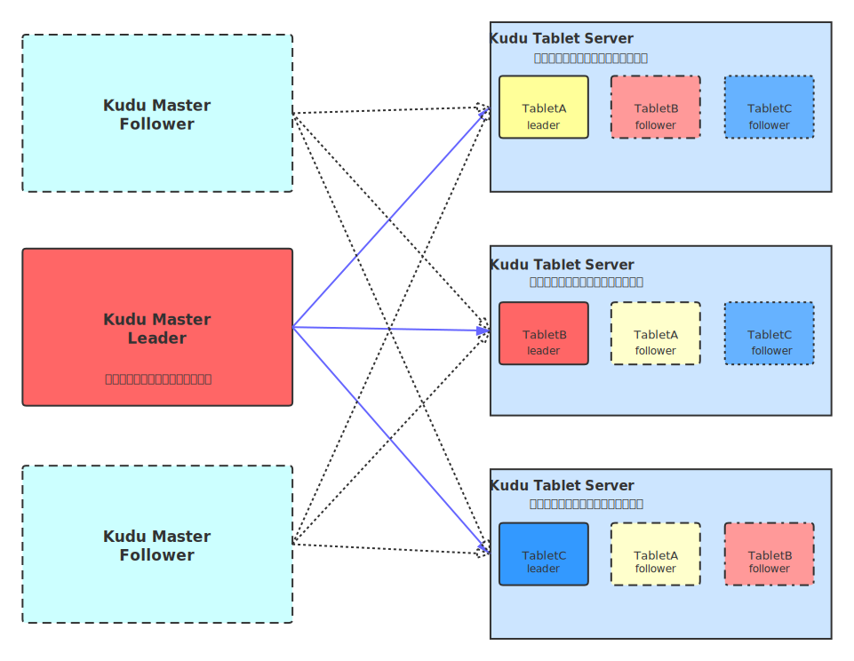

# Kudu

## Overview

>  Apache Kudu是由Cloudera开源的存储引擎，可以<u>同时提供低延迟的随机读写和高效的数据分析能力</u>。它是一个融合HDFS和HBase的功能的新组件，具备介于两者之间的新存储组件。

### 背景

- 静态数据
  - 以HDFS 引擎作为存储引擎，适用于高吞吐量的离线大数据分析场景
  - 这类存储的局限性是数据无法进行随机的读写
- 动态数据
  - HBase这类列式存储的数据引擎，支持海量数据的随机读写
  - 由于底层是HDFS所以批量读取取决于HDFS，无法实现批量数据的分析
- **Kudu的定位是Fast Analytics on Fast Data，是一个既支持随机读写、又支持OLAP 分析的大数据存储引擎**
  - Kudu是介于HDFS和HBase之间的产品，支持数据随机读写与OLAP分析

### 应用场景

- 1．Strong performance for both scan and random access to help customers simplify complex hybrid architectures（适用于那些既有随机访问，也有批量数据扫描的复合场景）
- 2．High CPU efficiency in order to maximize the return on investment that our customers are making in modern processors（高计算量的场景）
- 3．High IO efficiency in order to leverage modern persistent storage（使用了高性能的存储设备，包括使用更多的内存）
- 4．The ability to upDATE data in place, to avoid extraneous processing and data movement（支持数据更新，避免数据反复迁移）
- 5．The ability to support active-active replicated clusters that span multiple data centers in geographically distant locations（支持跨地域的实时数据备份和查询）

## 架构

Kudu 中存在两个角色：

- Mater Server：负责集群管理、元数据管理等功能
- Tablet Server：负责数据存储，并提供数据读写服务

> 为了实现分区容错性，跟其他大数据产品一样，对于每个角色，在 KUDU 中都可以设置特定数量（3 或 5）的副本。各副本间通过 Raft 协议来保证数据一致性。Raft 协议与 ZAB 类似，都是 Paxos 协议的工程简化版本

### 数据类型

KUDU 的数据模型与传统的关系型数据库类似，一个 KUDU 集群由多个表组成，每个表由多个字段组成，<u>一个表必须指定一个由若干个（>=1）字段组成的主键</u>

Kudu中的每个字段类型都是强类型的，这与HBase的表中数据类型有所不同，HBase中所有的数据类型都是Bytes，Kudu中可以允许不同的字段设定不同的数据类型，这样就使得针对不同的累心可以使用不同的编码，从而节省了存储空间。

### 存储策略

**KUDU 是一个列式存储的存储引擎**

- Table（表）：一张表table是数据存储在Kudu的从节点tablet server中。表具有 schema 和全局有序的primary key（主键）。table 被分成称为 tablets 的 segments。
- Tablet：
  - 1）、一个 tablet 是一张 table连续的segment，tablet是Kudu表的水平分区，类似于googleBigtable的tablet，或者HBase的region。
  - 2）、每个tablet存储着一定连续range的数据（key），且tablet两两间的range不会重叠。一张表的所有tablet包含了这张表的所有key空间。与其它数据存储引擎或关系型数据库中的 partition（分区）相似。
  - 3）、给定的tablet 冗余到多个 tablet server 服务器上，并且在任何给定的时间点，其中一个副本是leader tablet，其他的副本为follower tablet。
  - 4）、每个Tablet同时只有一个leader副本，这个副本对用户提供修改操作，然后将修改结果同步给follower。
  - 5）、Follower只提供读服务，不提供修改服务。副本之间使用raft协议来实现HighAvailability，当leader所在的节点发生故障时，followers会重新选举leader。Raft协议的另一个作用是实现Consistency。Client对leader的修改操作，需要同步到N/2+1个节点上，该操作才算成功

列式存储的数据库很适合于 OLAP 场景，其特点如下：

- 优势：查询少量列时 IO 少，速度快；数据压缩比高；便于查询引擎性能优化：延迟物化、直接操作压缩数据、向量化执行。
- 劣势：查询列太多时性能下降（KUDU 建议列数不超过 300）；不适合 OLTP 场景

### 分区策略

- 范围分区（Range Partitioning）
  - 方便分区扩展
  - 但是容易造成一个范围内数据量大的话落在同一个Tablet上，造成写大压力大
- 哈希分区（Hash Partitioning）
  - 数据的写入会被散落在各个Tablet上，数据写入的速度快
  - 但是不方便分区的横向扩展
  - 不利于数据顺序读的场景，造成顺序读数据的吞吐量低
- 多级分区
  - <u>Kudu允许用户对一个表指定一个范围分区和多个Hash分区</u>

