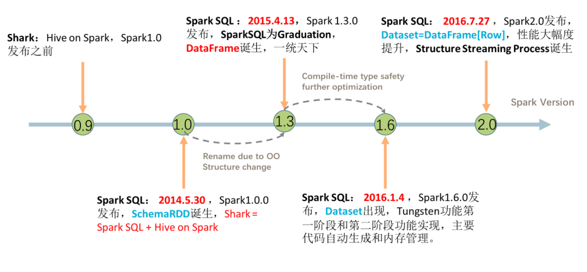

# Spark SQL 

## 概述

> **Spark SQL** is Apache Spark's module for working with structured data.
>
> *针对结构化数据处理的模块*

从Spark 2.2.0开始，在生产环境中既可以用于离线分析又可以用于实时分析

- 离线分析：`SparkSQL`模块
- 实时分析：`StructuredStreaming`模块，属于SparkSQL模块针对实时流式数据处理功能

### 历史时间线

> SparkSQL模块一直到Spark 2.0版本才算真正稳定，发挥其巨大功能

SparkSQL模块来源于Hive框架，但是其功能远大于Hive，SparkSQL用于Hive的所有功能，并且SparkSQL天然集成（兼容）Hive，从其中读取数据进行分析处理

### 数据结构

> DataFrame = RDD[Row] + Schema 

> Dataset =  RDD + Schema 

> DataFrame = Dataset[Row]

## DataFrame

> 在Spark中，DataFrame是一种以RDD为基础的分布式数据集，类似于传统数据库中的二维表格
>
> DataFrame与RDD的主要区别在于，前者带有schema元信息，即DataFrame所表示的二维表数据集的每一列都带有名称和类型。使得Spark SQL得以洞察更多的结构信息，从而对藏于DataFrame背后的数据源以及作用于DataFrame之上的变换进行针对性的优化，最终达到大幅提升运行时效率。反观RDD，由于无从得
> 知所存数据元素的具体内部结构，Spark Core只能在stage层面进行简单、通用的流水线优化。

`Dataset`：*A DataSet is a distributed collection of data.* (分布式的数据集)

`DataFrame`： *A DataFrame is a DataSet organized into named columns*.（以列（列名，列类
型，列值）的形式构成的分布式的数据集，按照列赋予不同的名称）

- 特性：
  - 1）、分布式的数据集，并且以列的方式组合的，相当于具有schema的RDD；
  - 2）、相当于关系型数据库中的表，但是底层有优化；
  - 3）、提供了一些抽象的操作，如select、filter、aggregation、plot；
  - 4）、它是由于R语言或者Pandas语言处理小数据集的经验应用到处理分布式大数据集上；
  - 5）、在1.3版本之前，叫SchemaRDD；

