# Structured Streaming

> Structured Streaming是一个基于Spark SQL引擎的可扩展、容错的流处理引擎

> Spark Streaming是Apache Spark早期基于RDD开发的流式系统，用户使用DStream API来编写代码，支持高吞吐和良好的容错。其背后的<u>主要模型是Micro Batch（微批处理），也就是将数据流切成等时间间隔（BatchInterval）的小批量任务来执行</u>。<u>一个流的数据源从逻辑上来说就是一个不断增长的动态表格，随着时间的推移，新数据被持续不断地添加到表格的末尾，用户可以使用Dataset/DataFrame或者 SQL 来对这个动态数据源进行实时查询</u>。

## Spark Streaming的不足

- 使用 Processing Time 而不是 Event Time
  - Spark Streaming是基于DStream模型的micro-batch模式，简单来说就是将一个微小时间段（比如说 1s）的流数据当前批数据来处理。如果要统计某个时间段的一些数据统计，毫无疑问应该使用 Event Time，但是因为 **Spark Streaming 的数据切割是基于Processing Time，这样就导致使用 Event Time 特别的困难。**
- Complex, low-level api
  - DStream（Spark Streaming 的数据模型）提供的API类似RDD的API，非常的low level；
  - 当编写Spark Streaming程序的时候，本质上就是要去构造RDD的DAG执行图，然后通过Spark Engine运行。这样导致一个问题是，DAG 可能会因为开发者的水平参差不齐而导致执行效率上的天壤之别

- reason about end-to-end application
  - DStream 只能保证自己的一致性语义是 exactly-once 的，而 input 接入 Spark Streaming 和 Spark Straming 输出到外部存储的语义往往需要用户自己来保证；
- 批流代码不统一
  - Streaming尽管是对RDD的封装，但是要将DStream代码完全转换成RDD还是有一点工作量的，更何况现在Spark的批处理都用DataSet/DataFrameAPI

## Structured Streaming 和其他系统的显著区别

- Incremental query model（增量查询模型）
  - Structured Streaming 将会在新增的流式数据上不断执行增量查询，同时代码的写法和批处理 API（基于Dataframe和Dataset API）完全一样，而且这些API非常的简单
- Support for end-to-end application（支持端到端应用）
  - Structured Streaming 和内置的 connector 使的 end-to-end 程序写起来非常的简单，而且 "correct by default"。数据源和sink满足 "exactly-once" 语义，这样我们就可以在此基础上更好地和外部系统集成
- Spark SQL 执行引擎做了非常多的优化工作，比如执行计划优化、codegen、内存管理等。这也是Structured Streaming取得高性能和高吞吐的一个原因

## 核心思想

> Structured Streaming最核心的思想就是**将实时到达的数据看作是一个不断追加的unbound table无界表，到达流的每个数据项就像是表中的一个新行被附加到无边界的表中，用静态结构化数据的批处理查询方式进行流计算**。

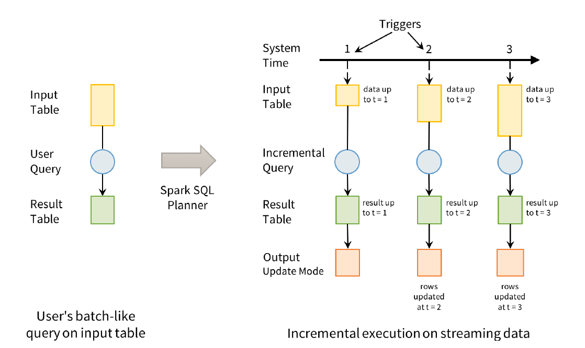

## 输入源

- File Source
  - text、csv、json、orc、parquet
- Socket Source
- Rate Source
  - 以每秒指定的行数生成数据，每个输出行包含2个字段：timestamp和value。其中timestamp是一个Timestamp含有信息分配的时间类型，并且value是Long（包含消息的计数从0开始作为第一行）类型。此源用于测试和基准测试
- Kafka Source

## Streaming Queries

### 输出模式

- Append Mode：追加模式，默认模式
  - 其中只有自从上一次触发以来，添加到 Result Table 的新行将会是outputted to the sink。只有添加到Result Table的行将永远不会改变那些查询才支持这一点。这种模式保证每行只能输出一次（假设 fault-tolerant sink ）。例如，只有select, where, map, flatMap, filter, join等查询支持 Append mode 。**只输出那些将来永远不可能再更新的数据，然后数据从内存移除 。没有聚合的时候，append和update一致；有聚合的时候，一定要有水印，才能使用**

- Complete Mode：完全模式
  - 每次触发后，整个Result Table将被输出到sink，aggregation  queries（聚合查询）支持。全部输出，必须有聚合
- Update Mode：更新模式
  - 只有 Result Table rows 自上次触发后更新将被输出到 sink。与Complete模式不同，因为该模式只输出自上次触发器以来已经改变的行。如果查询不包含聚合，那么等同于Append模式。只输出更新数据(更新和新增)

#### 不同的模式支持不同的输出模式

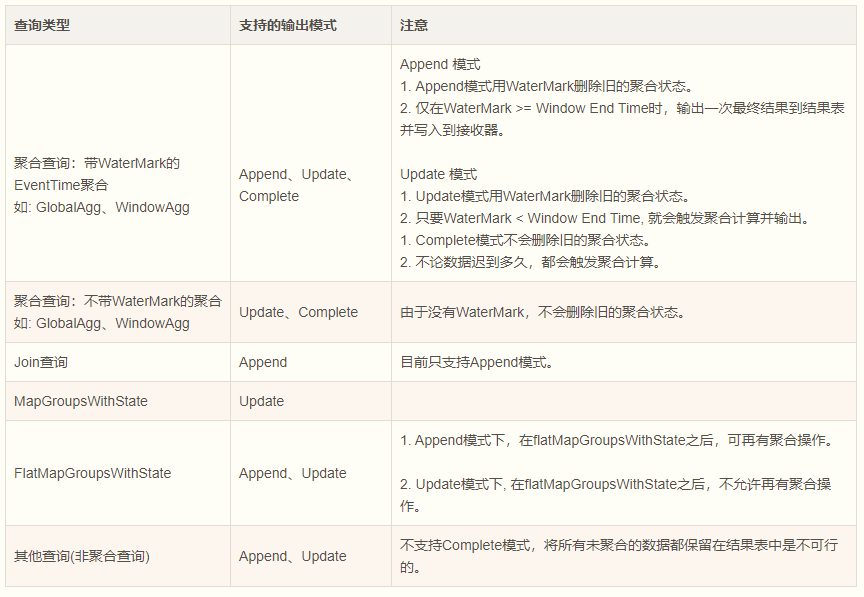

### 触发间隔

触发器Trigger决定了多久执行一次查询并输出结果，当不设置时，默认只要有新数据，就立即执行查询Query，再进行输出

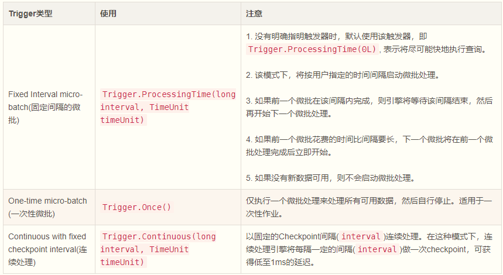

### 检查点

在Structured Streaming中使用Checkpoint 检查点进行故障恢复。如果实时应用发生故障或关机，可以恢复之前的查询的进度和状态，并从停止的地方继续执行，使用Checkpoint和预写日志WAL完成。使用检查点位置配置查询，那么查询将所有进度信息（即每个触发器中处理的偏移范围）和运行聚合（例如词频统计wordcount）保存到检查点位置。此检查点位置必须是HDFS兼容文件系统中的路径，两种方式设置Checkpoint Location位置：

- 方式一：DataStreamWriter设置
  - `streamDF.writeStream.option("checkpointLocation", "xxx")`
- 方式二：SparkConf设置
  - `sparkConf.set("spark.sql.streaming.checkpointLocation", "xxx")`

检查点内容：

- 偏移量目录【offsets】
- 提交记录目录【commits】
- 元数据文件【metadata】
- 数据源目录【sources】
  - sources 目录为数据源(Source)时各个批次读取详情
- 数据接收端目录【sinks】
  - sinks 目录为数据接收端(Sink)时批次的写出详情
- 记录状态目录【state】

### 输出Sinks

> Structured Streaming 非常显式地提出了**输入(Source)、执行(StreamExecution)、输出(Sink)**的3个组件，并且在每个组件显式地做到fault-tolerant（容错），由此得到整个streaming程序的 `end-to-end exactly-once guarantees`

目前Structured Streaming内置

1. FileSink

2. Console Sink
3. Foreach Sink（ForeachBatch Sink）
4. Memory Sink及Kafka Sink

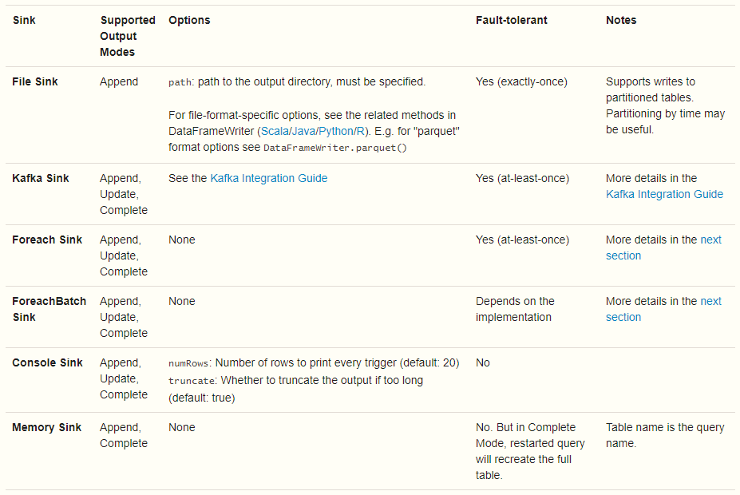

#### 文件接收器

将输出存储到目录文件中，支持文件格式：parquet、orc、json、csv等

> 注意:
>
> - 支持OutputMode为：Append追加模式
> - 必须指定输出目录参数【path】，必选参数，其中格式有parquet、orc、json、csv等等
> - 容灾恢复支持精确一次性语义exactly-once
> - 此外支持写入分区表，实际项目中常常按时间划分

#### Memory Sink

此种接收器作为调试使用，输出作为内存表存储在内存中， 支持Append和Complete输出模式。这应该用于低数据量的调试目的，因为整个输出被收集并存储在驱动程序的内存中，因此，请谨慎使用

#### Foreach Sink

Structured Streaming提供接口foreach和foreachBatch，允许用户在流式查询的输出上应用任意操作和编写逻辑，比如输出到MySQL表、Redis数据库等外部存系统。其中**foreach允许每行自定义写入逻辑，foreachBatch允许在每个微批量的输出上进行任意操作和自定义逻辑，建议使用foreachBatch操作**。
foreach表达自定义编写器逻辑具体来说，需要编写类class继承ForeachWriter，其中包含三个方法来表达数据写入逻辑：打开，处理和关闭

~~~scala
streamingDatasetOfString.writeStream.foreach(
    new ForeachWriter[String] { 
        def open(partitionId: Long, version: Long): Boolean = { // Open connection }
        def process(record: String): Unit = { // Write string to connection }
        def close(errorOrNull: Throwable): Unit = { // Close the connection } 
   } 
).start()
~~~

举个代码栗子:

如果要实现将词频统计结果写入MySQL：编写MySQLForeachWriter，继承ForeachWriter，其中DataFrame中数据类型为Row

~~~scala
/** * 创建类继承ForeachWriter，将数据写入到MySQL表中，泛型为：Row，针对DataFrame操作，每条数据类型就是Row */ 
class MySQLForeachWriter extends ForeachWriter[Row]{ 
    // 定义变量 
    var conn: Connection = _ var pstmt: PreparedStatement = _ val insertSQL = "REPLACE INTO `tb_word_count` (`id`, `word`, `count`) VALUES (NULL, ?, ?)" 
    // open connection 
    override def open(partitionId: Long, version: Long): Boolean = { 
        // a. 加载驱动类 
        Class.forName("com.mysql.cj.jdbc.Driver") 
        // b. 获取连接 
        conn = DriverManager.getConnection( "jdbc:mysql://node1:3306/db_sparkserverTimezone=UTC&characterEncoding=utf8&useUnicode=true",
                                           "root",
                                           "123456" )
// c. 获取PreparedStatement 
        pstmt = conn.prepareStatement(insertSQL) 
        //println(s"p-${partitionId}: ${conn}") 
        // 返回，表示获取连接成功 
        true } 
    // write data to connection 
    override def process(row: Row): Unit = { 
        // 设置参数 
        pstmt.setString(1, row.getAs[String]("value")) 
        pstmt.setLong(2, row.getAs[Long]("count")) 
        // 执行插入 
        pstmt.executeUpdate()
    } 
    // close the connection 
    override def close(errorOrNull: Throwable): Unit = { 
        if(null != pstmt) pstmt.close() 
        if(null != conn) conn.close() 
    } 
}
~~~

调用方法:

~~~scala
// 设置Streaming应用输出及启动 
val query: StreamingQuery = resultStreamDF.writeStream 
// 对流式应用输出来说，设置输出模式，Update表示有数据更新才输出，没数据更新不输出 
	.outputMode(OutputMode.Update()) 
	.foreach(new MySQLForeachWriter()) 
	.start() // 启动start流式应用
~~~

#### ForeachBatch Sink

方法foreachBatch允许指定在流式查询的每个微批次的输出数据上执行的函数，需要两个参数：微批次的输出数据DataFrame或Dataset、微批次的唯一ID

注意:

- 第一、重用现有的批处理数据源，可以在每个微批次的输出上使用批处理数据输出Output

- 第二、写入多个位置，如果要将流式查询的输出写入多个位置，则可以简单地多次写入输出 DataFrame/Dataset 。但是，每次写入尝试都会导致重新计算输出数据（包括可能重新读取输入数据）。要避免重新计算，您应该缓存cache输出 DataFrame/Dataset，将其写入多个位置，然后 uncache

  

- 第三、应用其他DataFrame操作，流式DataFrame中不支持许多DataFrame和Dataset操作，使用foreachBatch可以在每个微批输出上应用其中一些操作，但是，必须自己解释执行该操作的端到端语义
- 第四、默认情况下，foreachBatch仅提供至少一次写保证。 但是，可以使用提供给该函数的batchId作为重复数据删除输出并获得一次性保证的方法
- 第五、foreachBatch不适用于连续处理模式，因为它从根本上依赖于流式查询的微批量执行。 如果以连续模式写入数据，请改用foreach

举个栗子:使用foreachBatch写入MySQL

~~~scala
val query = resultStreamDF
      .writeStream
      .outputMode(OutputMode.Update())
      .queryName("query-wordcount")
      .trigger(Trigger.ProcessingTime("5 seconds"))

      /**
       * VITAL: 使用foreach 函数将数据保存到MySQL
       */
      //def foreachBatch(function: VoidFunction2[Dataset[T], java.lang.Long]): DataStreamWriter[T]
      .foreachBatch { (batchDF: DataFrame, batchId: Long) =>
        println(s"BatchID: ${batchId}")
        if (!batchDF.isEmpty) {
          batchDF
            //降低分区数目
            .coalesce(1)
            .write
            .mode(SaveMode.Overwrite)
            .format("jdbc")
            .option("driver", "com.mysql.cj.jdbc.Driver")
            .option("url", "jdbc:mysql://node1:3306/?serverTimezone=UTC&characterEncoding=utf8&useUnicode=true")
            .option("user", "root")
            .option("password", "123456")
            .option("dbtable", "db_spark.tb_word_count2")
            .save()
        }
      }
      // 设置检查点目录
      .option("checkpointLocation", "datas/structured/ckpt-wordcount002")
      .start() // 启动流式查询
~~~

### 容错语义

> Structured Streaming的核心设计理念和目标之一：支持一次且仅一次Extracly-Once的语义

任意流式系统处理流式数据三个步骤:

- 1、Receiving the data：接收数据源端的数据
- 2、Transforming the data：转换数据，进行处理分析
- 3、Pushing out the data：将结果数据输出

在处理数据时，往往需要保证数据处理一致性语义：从数据源端接收数据，经过数据处理分析，到最终数据输出仅被处理一次，是最理想最好的状态。在Streaming数据处理分析中，需要考虑数据是否被处理及被处理次数，称为消费语义，主要有三种：

- At most once：最多一次，可能出现不消费，数据丢失
- At least once：至少一次，数据至少消费一次，可能出现多次消费数据
- Exactly once：精确一次，数据当且仅当消费一次，不多不少

**为了实现Exactly-Once语义目标，Structured Streaming设计source、sink和execution engine来追踪计算处理的进度，这样就可以在任何一个步骤出现失败时自动重试**

- 每个Streaming source都被设计成支持offset，进而可以让Spark来追踪读取的位置
- Spark基于checkpoint和wal来持久化保存每个trigger interval内处理的offset的范围
- ink被设计成可以支持在多次计算处理时保持幂等性，就是说，用同样的一批数据，无论多少次去更新sink，都会保持一致和相同的状态

综合利用**基于offset的source**，**基于checkpoint和wal的execution engine**，以及**基于幂等性的sink**，可以支持完整的一次且仅一次的语义。

## 集成Kafka

[StructuredStreaming集成Kafka](http://spark.apache.org/docs/2.4.5/structured-streaming-kafka-integration.html)

> 目前仅支持Kafka 0.10.+版本及以上，底层使用Kafka New Consumer API拉取数据，如果Kafka版本为0.8.0版本，[StructuredStreaming集成Kafka参考文档](https://github.com/jerryshao/spark-kafka-0-8-sql)

### Kafka  Source

Structured Streaming消费Kafka数据，采用的是poll方式拉取数据，与Spark Streaming中New Consumer API集成方式一致。从Kafka Topics中读取消息，需要指定数据源（kafka）、Kafka集群的连接地址（kafka.bootstrap.servers）、消费的topic（subscribe或subscribePattern）， 指定topic 的时候，可以使用正则来指定，也可以指定一个 topic 的集合

消费kafka Topic数据的三种方式

- 消费一个Topic数据

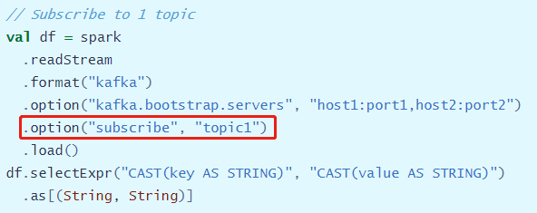

- 消费多个Topic数据

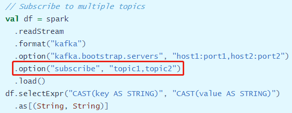

- 消费通配符匹配Topic数据

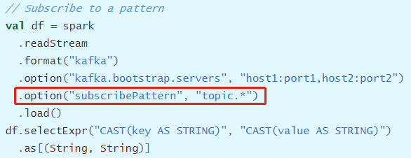

在实际开发时，往往需要获取每条数据的消息，存储在value字段中，**由于是binary类型，需要转换为字符串String类型**；此外了方便数据操作，通常将获取的key和value的DataFrame转换为Dataset强类型:

~~~scala
val inputStreamDF: Dataset[String] = kafkaStreamDF
      //Selects a set of SQL expressions. This is a variant of `select` that accepts SQL expressions.
      .selectExpr("CAST(VALUE AS STRING)")
      .as[String]
~~~

### Sink Kafka

往Kafka里面写数据类似读取数据，可以在DataFrame上调用writeStream来写入Kafka，设置参数指定value，其中key是可选的，如果不指定就是null。如果key为null，有时候可能导致分区数据不均匀。

DataFrame写入Kafka时Schema需要的字段：

- key(String or binary)
- value(String or binary)
- topic(String)

### Kafka配置

[生产者配置(Producer Configs)](http://kafka.apache.org/20/documentation.html#producerconfigs)

[消费者配置(Consumer Configs)](http://kafka.apache.org/20/documentation.html#newconsumerconfigs)

注意以下Kafka参数属性可以不设置，如果设置的话，Kafka source或者sink可能会抛出错误：

- group.id：Kafka source将会自动为每次查询创建唯一的分组ID；

- auto.offset.reset：在将source选项startingOffsets设置为指定从哪里开始。结构化流管理内部消费的偏移量，而不是依赖Kafka消费者来完成。这将确保在topic/partitons动态订阅时不会遗漏任何数据。注意，只有在启动新的流式查询时才会应用startingOffsets，并且恢复操作始终会从查询停止的位置启动；

- key.deserializer/value.deserializer：Keys/Values总是被反序列化为ByteArrayDeserializer的字节数组，使用DataFrame操作显式反序列化keys/values

  ~~~scala
  // 构建SparkConf对象
      val sparkConf: SparkConf = new SparkConf()
        .setAppName(clazz.getSimpleName.stripSuffix("$"))
        .set("spark.debug.maxToStringFields", "2000")
        .set("spark.sql.debug.maxToStringFields", "2000")
        // VITAL: 设置使用Kryo 序列化方式 当不能java序列化的时候，需要设置Kyro序列化
        .set("spark.serializer", "org.apache.spark.serializer.KryoSerializer")
        // VITAL: 注册序列化的数据类型
        .registerKryoClasses(Array(classOf[ImmutableBytesWritable], classOf[Result]))
  ~~~

- key.serializer/value.serializer：keys/values总是使用ByteArraySerializer或StringSerializer进行序列化，使用DataFrame操作将keysvalues/显示序列化为字符串或字节数组

- enable.auto.commit：Kafka source不提交任何offset

- interceptor.classes：Kafka source总是以字节数组的形式读取key和value。使用ConsumerInterceptor是不安全的，因为它可能会打断查询

## 事件时间窗口分析

> 在SparkStreaming中窗口统计分析：Window Operation（设置窗口大小WindowInterval和滑动大小SlideInterval），按照Streaming 流式应用接收数据的时间进行窗口设计的，其实是不符合实际应用场景的。
>
> 在结构化流Structured Streaming中窗口数据统计时间是基于数据本身事件时间EventTime字段统计，更加合理性，[官方文档](http://spark.apache.org/docs/2.4.5/structured-streaming-programming-guide.html#window-operations-on-event-time)

三种时间:

- 摄入时间
- 处理时间
- 事件时间

parkStreaming框架仅仅支持处理时间ProcessTime，StructuredStreaming支持事件时间和处理时间，Flink框架支持三种时间数据操作

### 案例：词频统计

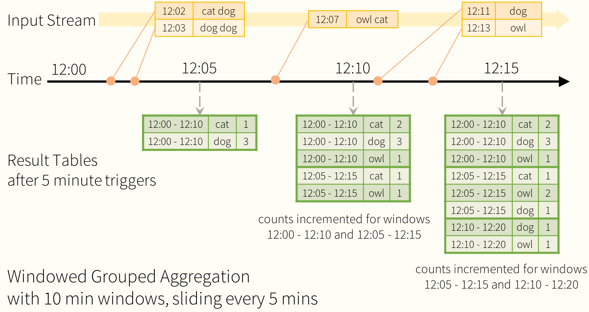

单词在10分钟窗口【12:00-12:10、12:05-12:15、12:10-12:20】等之间接收的单词中计数。注意，【12:00-12:10】表示处理数据的事件时间为12:00之后但12:10之前的数据。思考一下，12:07的一条数据，应该增加对应于两个窗口12:00-12:10和12:05-12:15的计数

### 窗口的生成

~~~scala
org.apache.spark.sql.catalyst.analysis.TimeWindowing
// 窗口个数
/* 最大的窗口数 = 向上取整(窗口长度/滑动步长) */
maxNumOverlapping <- ceil(windowDuration / slideDuration)
for (i <- 0 until maxNumOverlapping)
        /**
        timestamp是event-time 传进的时间戳
        startTime是window窗口参数，默认是0 second 从时间的0s
        含义：event-time从1970年...有多少个滑动步长，如果说浮点数会向上取整
        */
    windowId <- ceil((timestamp - startTime) / slideDuration)
        /**
        windowId * slideDuration 向上取能整除滑动步长的时间
        (i - maxNumOverlapping) * slideDuration 每一个窗口开始时间相差一个步长
        */
    windowStart <- windowId * slideDuration + (i - maxNumOverlapping) * slideDuration + startTime
    windowEnd <- windowStart + windowDuration
    return windowStart, windowEnd
~~~

- 将【(event-time向上取 能整除 滑动步长的时间) - (最大窗口数×滑动步长)】作为"初始窗口"的开始时间，然后按照窗口滑动宽度逐渐向时间轴前方推进，直到某个窗口不再包含该event-time 为止，最终以"初始窗口"与"结束窗口"之间的若干个窗口作为最终生成的 event-time 的时间窗口

- 每个窗口的起始时间start与结束时间end都是前闭后开（左闭右开）的区间，因此初始窗口和结束窗口都不会包含 event-time，最终不会被使用。假设数据为【2019-08-14 10:50:00, dog】，按照上述规则计算窗口示意图如下：

  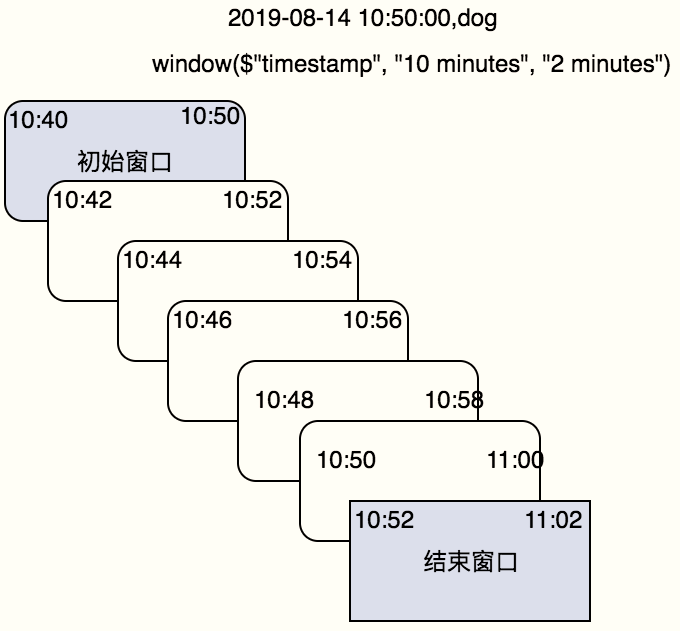
  得到窗口如下:

### 延迟数据

Structured Streaming可以保证一条旧的数据进入到流上时，依然可以基于这些“迟到”的数据重新计算并更新计算结果

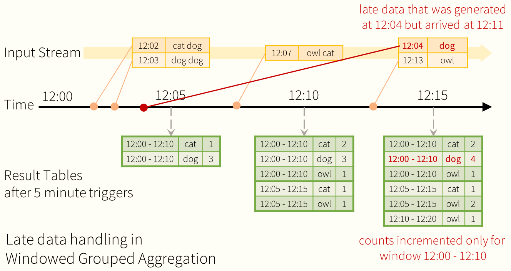

> 上图中在12:04（即事件时间）生成的单词可能在12:11被应用程序接收，此时，应用程序应使用时间12:04而不是12:11更新窗口12:00-12:10的旧计数

### Watermark

> lets the engine automatically track the current event time in the data and attempt to clean up old state accordingly.

Spark 2.1引入的watermarking允许用户指定延迟数据的阈值，也允许引擎清除掉旧的状态。即根据watermark机制来设置和判断消息的有效性，如可以获取消息本身的时间戳，然后根据该时间戳来判断消息的到达是否延迟（乱序）以及延迟的时间是否在容忍的范围内（延迟的数据是否处理）。

#### 设置水位线

通过指定event-time列（上一批次数据中EventTime最大值）和预估事件的延迟时间上限（Threshold）来定义一个查询的水位线watermark。

~~~scala
Watermark = MaxEventTime - Threshod
~~~

> 注意:
>
> - 执行第一批次数据时，Watermarker为0，所以此批次中所有数据都参与计算
> - Watermarker值只能逐渐增加，不能减少
> - Watermark机制主要解决处理聚合延迟数据和减少内存中维护的聚合状态
> - 设置Watermark以后，输出模式OutputMode只能是Append和Update

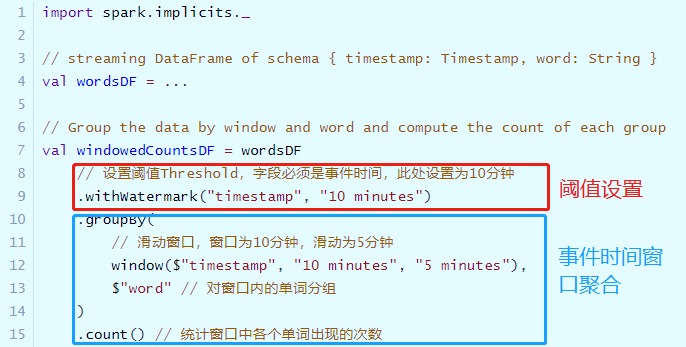

#### 官方案例

词频统计WordCount，设置阈值Threshold为10分钟，每5分钟触发执行一次

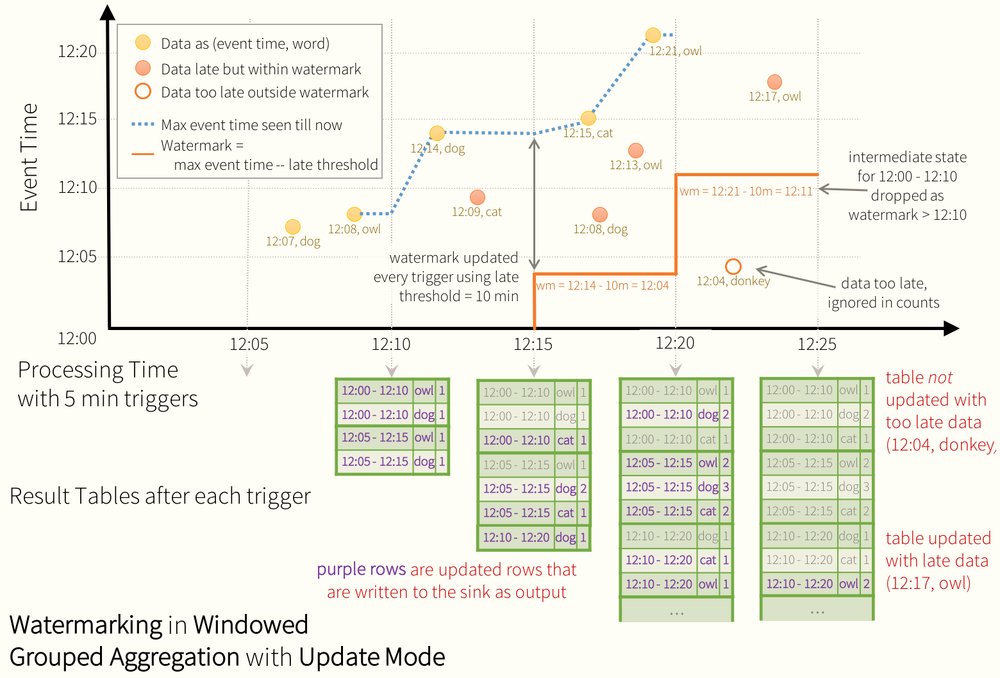

- 延迟到达但没有超过watermark：(12:08, dog)
  - 在12:20触发执行窗口（12:10-12:20）数据中，(12:08, dog) 数据是延迟数据，阈值Threshold设定为10分钟，此时水位线【Watermark = 12:14 - 10m = 12:04】，因为12:14是上个窗口（12:05-12:15）中接收到的最大的事件时间，代表目标系统最后时刻的状态，由于12:08在12:04之后，因此被视为“虽然迟到但尚且可以接收”的数据而被更新到了结果表中，也就是(12:00 - 12:10, dog, 2)和(12:05 - 12:11, dog, 3)

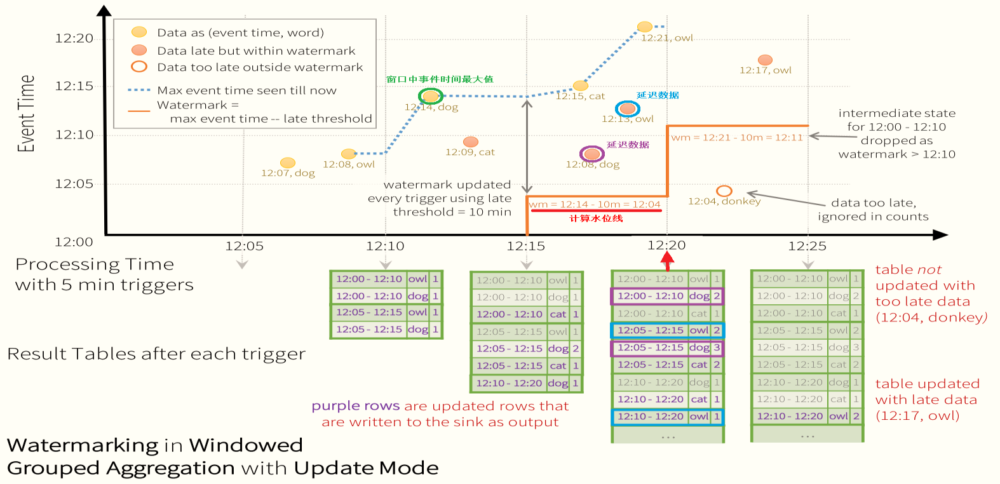

- 超出watermark：(12:04, donkey)
  - 在12:25触发执行窗口（12:15-12:25）数据中，(12:04, donkey)数据是延迟数据，上个窗口中接收到最大的事件时间为12:21，此时水位线【Watermark = 12:21 - 10m = 12:11】，而(12:04, donkey)比这个值还要早，说明它”太旧了”，所以不会被更新到结果表中了

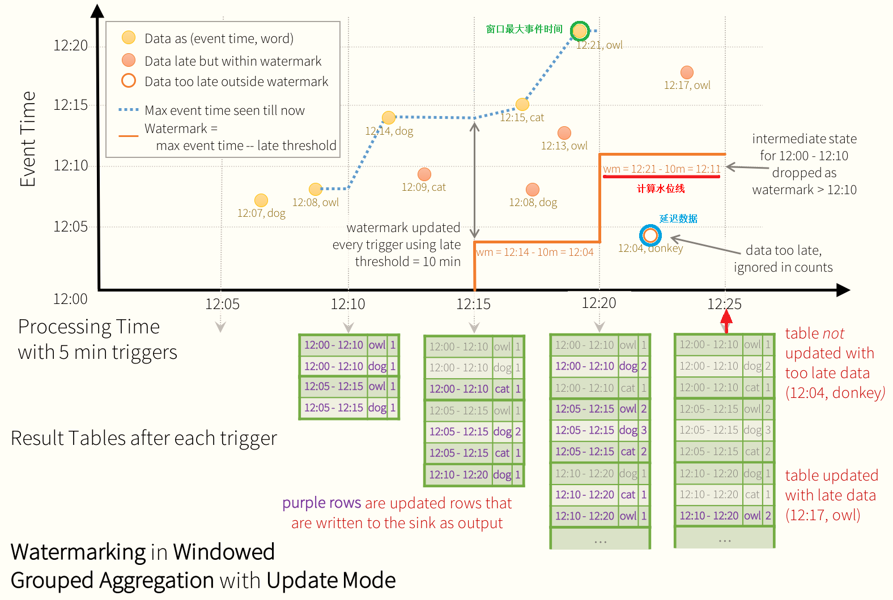

设置水位线Watermark以后，不同输出模式OutputMode，结果输出不一样：

- Update模式：总是倾向于“尽可能早”的将处理结果更新到sink，当出现迟到数据时，早期的某个计算结果将会被更新
- Append模式：推迟计算结果的输出到一个相对较晚的时刻，确保结果是稳定的，不会再被更新，比如：12:00 - 12:10窗口的处理结果会等到watermark更新到12：11之后才会写入到sink

> 如果用于接收处理结果的sink不支持更新操作，则只能选择Append模式

## Streaming Deduplication

#### 用武之地

在实时流式应用中，最典型的应用场景：网站UV统计

- 业务需求一：实时统计网站UV，比如每日网站UV
- 业务需求二：统计最近一段时间（比如一个小时）网站UV，可以设置水位Watermark

在SparkStreaming或Flink框架中要想实现【网站UV统计】需要借助于外部存储系统，比如Redis内存数据库或者HBase列式存储数据库，存储UserId，利用数据库特性去重，最后进行count。Structured Streaming可以使用deduplication对有无Watermark的流式数据进行去重操作：

- 无 Watermark：对重复记录到达的时间没有限制。查询会保留所有的过去记录作为状态用于去重
- 有 Watermark：对重复记录到达的时间有限制。查询会根据水印删除旧的状态数据

#### 使用

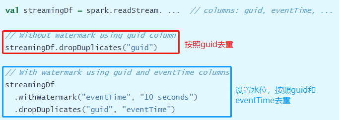

#### 代码示例

~~~scala
/**
 * StructuredStreaming对流数据按照某些字段进行去重操作，比如实现UV类似统计分析
 * TODO:待测试
 */
object StructuredDeduplication {
  def main(args: Array[String]): Unit = {
    val spark: SparkSession = SparkSession.builder()
      .appName(this.getClass.getSimpleName.stripSuffix("$"))
      .master("local[2]")
      .config("spark.sql.shuffle.partitions", "2")
      .getOrCreate()
    import spark.implicits._
    import org.apache.spark.sql.functions._

    val inputTable: DataFrame = spark.readStream
      .format("socket")
      .option("host", "node1")
      .option("port", 9999)
      .load()

    val resultTableDF: DataFrame = inputTable
      .as[String]
      .filter(line => line != null && line.trim.length > 0)
      .select(
        get_json_object($"value", "$.eventTime").as("eventTime"),
        get_json_object($"value", "$.eventType").as("eventType"),
        get_json_object($"value", "$.userID").as("userID")
      )
      //按照userID和eventType进行去重
      .dropDuplicates("userID", "eventType")
      .groupBy($"userID", $"eventType")
      .count()

    val query = resultTableDF
      .writeStream
      .outputMode(OutputMode.Complete())
      .format("console")
      .option("numRows", "100")
      .option("truncate", "false")
      //VITAL:流式应用需要启动
      .start()

    query.awaitTermination()
    query.stop()

  }
}
~~~

## 附录

### 幂等性

> 在HTTP/1.1中对幂等性的定义：一次和多次请求某一个资源对于资源本身应该具有同样的结果（网络超时等问题除外）。也就是说，其任意多次执行对资源本身所产生的影响均与一次执行的影响相同。幂等性是系统服务对外一种承诺（而不是实现），承诺只要调用接口成功，外部多次调用对系统的影响是一致的。声明为幂等的服务会认为外部调用失败是常态，并且失败之后必然会有重试

