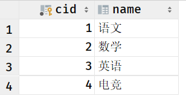
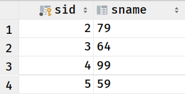

# SQL JOINS

- **INNER JOIN** (JOIN)：如果表中有至少一个匹配，则返回行
- **LEFT JOIN**(LEFT OUTER JOIN)：即使右表中没有匹配，也从左表返回所有的行
- **RIGHT JOIN**(RIGHT OUTER JOIN)：即使左表中没有匹配，也从右表返回所有的行

## 几个测试说明各种join的区别:

测试条件，先建两张表，第一张为course，即学科表，第二张score，即成绩表

~~~MySQL
create table if not exists course (
    cid int(5) primary key not null auto_increment,
    name varchar(50)
);

insert into course values (1,'语文');
insert into course values (2,'数学');
insert into course values (3,'英语');
insert into course values (4,'电竞');
~~~

~~~MySQL
create table if not exists score (
    sid int(5) primary key not null  auto_increment,
    sname varchar(50)
);

insert into score (sid, sname)
values (2,'79');
insert into score (sid, sname)
values (3,'64');
insert into score (sid, sname)
values (4,'99');
insert into score(sid, sname)
values (5, '59');
~~~

**左连接**，即连接以左表为主，查询出以符合指定连接条件的左表全部内容，并且以指定条件关联右表内容。测试左连接`LEFT JOIN`:

~~~MySQL
select *
from course c
         left join score s
                   on c.cid = s.sid;
~~~

测试结果：

**右连接**，即以右表为主，查询出以符合指定连接条件的右表全部内容，并且以指定条件关联左表内容。测试右连接`RIGHT JOIN`:

~~~MySQL
select *
from course c
         right join score s
                    on c.cid = s.sid;
~~~

测试结果：

**内连接**(即join)，以指定条件连接两表，查询出两张表的交集，测试内连接`INNER JOIN`：

~~~MySQL
select *
from course c
         inner join score s
                    on c.cid = s.sid;
~~~

测试结果：

至此，区分显而易见。